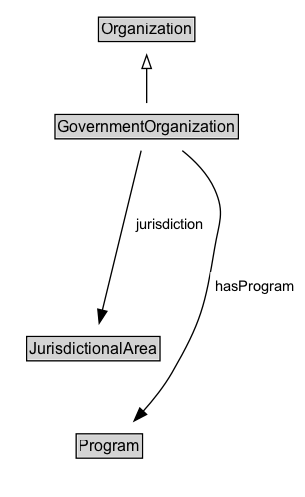

# GovernmentOrganization

## Diagram

=== "SVG (interactive)"

    <!-- Generated by graphviz version 14.1.3 (20260303.0454)
     -->
    <!-- Pages: 1 -->
    <svg width="229pt" height="373pt"
     viewBox="0.00 0.00 229.00 373.00" xmlns="http://www.w3.org/2000/svg" xmlns:xlink="http://www.w3.org/1999/xlink">
    <g id="graph0" class="graph" transform="scale(1 1) rotate(0) translate(4 368.5)">
    <polygon fill="white" stroke="none" points="-4,4 -4,-368.5 225,-368.5 225,4 -4,4"/>
    <g id="clust3" class="cluster">
    <title>cluster_associated</title>
    </g>
    <!-- Organization -->
    <g id="node1" class="node">
    <title>Organization</title>
    <g id="a_node1"><a xlink:href="../Organization" xlink:title="&lt;TABLE&gt;">
    <polygon fill="lightgray" stroke="none" points="70.88,-338.38 70.88,-354.62 141.12,-354.62 141.12,-338.38 70.88,-338.38"/>
    <text xml:space="preserve" text-anchor="start" x="71.88" y="-342.38" font-family="Arial" font-size="12.00">Organization</text>
    <polygon fill="none" stroke="black" points="69.88,-337.38 69.88,-355.62 142.12,-355.62 142.12,-337.38 69.88,-337.38"/>
    </a>
    </g>
    </g>
    <!-- GovernmentOrganization -->
    <g id="node2" class="node">
    <title>GovernmentOrganization</title>
    <g id="a_node2"><a xlink:href="../GovernmentOrganization" xlink:title="&lt;TABLE&gt;">
    <polygon fill="lightgray" stroke="none" points="38.25,-265.38 38.25,-281.62 173.75,-281.62 173.75,-265.38 38.25,-265.38"/>
    <text xml:space="preserve" text-anchor="start" x="39.25" y="-269.38" font-family="Arial" font-size="12.00">GovernmentOrganization</text>
    <polygon fill="none" stroke="black" points="37.25,-264.38 37.25,-282.62 174.75,-282.62 174.75,-264.38 37.25,-264.38"/>
    </a>
    </g>
    </g>
    <!-- GovernmentOrganization&#45;&gt;Organization -->
    <g id="edge1" class="edge">
    <title>GovernmentOrganization&#45;&gt;Organization</title>
    <path fill="none" stroke="black" d="M106,-291.21C106,-298.97 106,-308.42 106,-317.24"/>
    <polygon fill="none" stroke="black" points="102.5,-317.16 106,-327.16 109.5,-317.16 102.5,-317.16"/>
    </g>
    <!-- Invis -->
    <!-- GovernmentOrganization&#45;&gt;Invis -->
    <!-- JurisdictionalArea -->
    <g id="node4" class="node">
    <title>JurisdictionalArea</title>
    <g id="a_node4"><a xlink:href="../JurisdictionalArea" xlink:title="&lt;TABLE&gt;">
    <polygon fill="lightgray" stroke="none" points="17,-98.88 17,-115.12 115,-115.12 115,-98.88 17,-98.88"/>
    <text xml:space="preserve" text-anchor="start" x="18" y="-102.88" font-family="Arial" font-size="12.00">JurisdictionalArea</text>
    <polygon fill="none" stroke="black" points="16,-97.88 16,-116.12 116,-116.12 116,-97.88 16,-97.88"/>
    </a>
    </g>
    </g>
    <!-- GovernmentOrganization&#45;&gt;JurisdictionalArea -->
    <g id="edge6" class="edge">
    <title>GovernmentOrganization&#45;&gt;JurisdictionalArea</title>
    <path fill="none" stroke="black" d="M101.87,-255.52C94.98,-227.17 81.07,-169.97 72.74,-135.72"/>
    <polygon fill="black" stroke="black" points="76.17,-135.01 70.41,-126.12 69.37,-136.66 76.17,-135.01"/>
    <polygon fill="white" stroke="none" points="94.43,-189.75 94.43,-211.25 152.68,-211.25 152.68,-189.75 94.43,-189.75"/>
    <text xml:space="preserve" text-anchor="start" x="98.43" y="-196.75" font-family="Arial" font-size="11.00">jurisdiction</text>
    </g>
    <!-- Program -->
    <g id="node5" class="node">
    <title>Program</title>
    <g id="a_node5"><a xlink:href="../Program" xlink:title="&lt;TABLE&gt;">
    <polygon fill="lightgray" stroke="none" points="54.12,-25.88 54.12,-42.12 101.88,-42.12 101.88,-25.88 54.12,-25.88"/>
    <text xml:space="preserve" text-anchor="start" x="55.12" y="-29.88" font-family="Arial" font-size="12.00">Program</text>
    <polygon fill="none" stroke="black" points="53.12,-24.88 53.12,-43.12 102.88,-43.12 102.88,-24.88 53.12,-24.88"/>
    </a>
    </g>
    </g>
    <!-- GovernmentOrganization&#45;&gt;Program -->
    <g id="edge5" class="edge">
    <title>GovernmentOrganization&#45;&gt;Program</title>
    <path fill="none" stroke="black" d="M132.72,-255.52C142.24,-247.92 151.86,-238.05 157,-226.5 164.95,-208.63 160.21,-201.79 157,-182.5 149.79,-139.17 146.94,-127.05 125,-89 119.1,-78.77 111.11,-68.7 103.39,-60.07"/>
    <polygon fill="black" stroke="black" points="105.96,-57.69 96.57,-52.77 100.84,-62.47 105.96,-57.69"/>
    <polygon fill="white" stroke="none" points="153.75,-143 153.75,-164.5 221,-164.5 221,-143 153.75,-143"/>
    <text xml:space="preserve" text-anchor="start" x="157.75" y="-150" font-family="Arial" font-size="11.00">hasProgram</text>
    </g>
    <!-- Invis&#45;&gt;JurisdictionalArea -->
    <!-- JurisdictionalArea&#45;&gt;Program -->
    </g>
    </svg>

=== "PNG"

    

## Formalization for GovernmentOrganization

| Property | Constraint |
|----------|------------|
| [hasProgram](../properties/hasProgram.md) | only [Program](https://w3id.org/citydata/part2/v1/Program) |
| [jurisdiction](../properties/jurisdiction.md) | only [JurisdictionalArea](https://w3id.org/citydata/part2/v1/JurisdictionalArea) |
| subClassOf | [Organization](Organization.md) |

