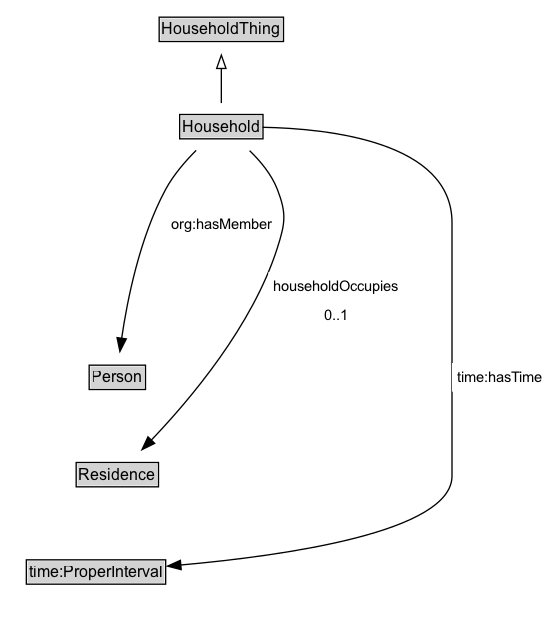

# Household

A Household refers to a collection of persons occupying a shared place of residence. Households may or may not be comprised of family members.

NOTE: More precise definitions of Household may be adopted as required for different contexts and applications through extensions to this class.

## Diagram

=== "SVG (interactive)"

    <!-- Generated by graphviz version 14.1.3 (20260303.0454)
     -->
    <!-- Pages: 1 -->
    <svg width="415pt" height="467pt"
     viewBox="0.00 0.00 415.00 467.00" xmlns="http://www.w3.org/2000/svg" xmlns:xlink="http://www.w3.org/1999/xlink">
    <g id="graph0" class="graph" transform="scale(1 1) rotate(0) translate(4 463)">
    <polygon fill="white" stroke="none" points="-4,4 -4,-463 410.75,-463 410.75,4 -4,4"/>
    <g id="clust3" class="cluster">
    <title>cluster_associated</title>
    </g>
    <!-- HouseholdThing -->
    <g id="node1" class="node">
    <title>HouseholdThing</title>
    <g id="a_node1"><a xlink:href="../HouseholdThing" xlink:title="&lt;TABLE&gt;">
    <polygon fill="lightgray" stroke="none" points="116.38,-432.88 116.38,-449.12 207.62,-449.12 207.62,-432.88 116.38,-432.88"/>
    <text xml:space="preserve" text-anchor="start" x="117.38" y="-436.88" font-family="Arial" font-size="12.00">HouseholdThing</text>
    <polygon fill="none" stroke="black" points="115.38,-431.88 115.38,-450.12 208.62,-450.12 208.62,-431.88 115.38,-431.88"/>
    </a>
    </g>
    </g>
    <!-- Household -->
    <g id="node2" class="node">
    <title>Household</title>
    <g id="a_node2"><a xlink:href="../Household" xlink:title="&lt;TABLE&gt;">
    <polygon fill="lightgray" stroke="none" points="131.75,-359.88 131.75,-376.12 192.25,-376.12 192.25,-359.88 131.75,-359.88"/>
    <text xml:space="preserve" text-anchor="start" x="132.75" y="-363.88" font-family="Arial" font-size="12.00">Household</text>
    <polygon fill="none" stroke="black" points="130.75,-358.88 130.75,-377.12 193.25,-377.12 193.25,-358.88 130.75,-358.88"/>
    </a>
    </g>
    </g>
    <!-- Household&#45;&gt;HouseholdThing -->
    <g id="edge1" class="edge">
    <title>Household&#45;&gt;HouseholdThing</title>
    <path fill="none" stroke="black" d="M162,-385.71C162,-393.47 162,-402.92 162,-411.74"/>
    <polygon fill="none" stroke="black" points="158.5,-411.66 162,-421.66 165.5,-411.66 158.5,-411.66"/>
    </g>
    <!-- Invis -->
    <!-- Household&#45;&gt;Invis -->
    <!-- Person -->
    <g id="node4" class="node">
    <title>Person</title>
    <g id="a_node4"><a xlink:href="../Person" xlink:title="&lt;TABLE&gt;">
    <polygon fill="lightgray" stroke="none" points="63.88,-171.88 63.88,-188.12 104.12,-188.12 104.12,-171.88 63.88,-171.88"/>
    <text xml:space="preserve" text-anchor="start" x="64.88" y="-175.88" font-family="Arial" font-size="12.00">Person</text>
    <polygon fill="none" stroke="black" points="62.88,-170.88 62.88,-189.12 105.12,-189.12 105.12,-170.88 62.88,-170.88"/>
    </a>
    </g>
    </g>
    <!-- Household&#45;&gt;Person -->
    <g id="edge6" class="edge">
    <title>Household&#45;&gt;Person</title>
    <path fill="none" stroke="black" d="M143.11,-350.23C135.01,-342.12 126.09,-331.82 120.25,-321 100.85,-285.08 91.47,-238.31 87.21,-208.97"/>
    <polygon fill="black" stroke="black" points="90.72,-208.85 85.93,-199.4 83.79,-209.78 90.72,-208.85"/>
    <polygon fill="white" stroke="none" points="120.25,-284.25 120.25,-305.75 204,-305.75 204,-284.25 120.25,-284.25"/>
    <text xml:space="preserve" text-anchor="start" x="124.25" y="-291.25" font-family="Arial" font-size="11.00">org:hasMember</text>
    </g>
    <!-- Residence -->
    <g id="node5" class="node">
    <title>Residence</title>
    <g id="a_node5"><a xlink:href="../Residence" xlink:title="&lt;TABLE&gt;">
    <polygon fill="lightgray" stroke="none" points="54.12,-98.88 54.12,-115.12 113.88,-115.12 113.88,-98.88 54.12,-98.88"/>
    <text xml:space="preserve" text-anchor="start" x="55.12" y="-102.88" font-family="Arial" font-size="12.00">Residence</text>
    <polygon fill="none" stroke="black" points="53.12,-97.88 53.12,-116.12 114.88,-116.12 114.88,-97.88 53.12,-97.88"/>
    </a>
    </g>
    </g>
    <!-- Household&#45;&gt;Residence -->
    <g id="edge7" class="edge">
    <title>Household&#45;&gt;Residence</title>
    <path fill="none" stroke="black" d="M183.2,-350C191.34,-342.14 199.7,-332.09 204,-321 211.07,-302.77 209.94,-295.63 204,-277 185.41,-218.71 138.59,-163.31 109.23,-132.66"/>
    <polygon fill="black" stroke="black" points="112,-130.49 102.51,-125.78 106.99,-135.38 112,-130.49"/>
    <polygon fill="white" stroke="none" points="197.32,-216 197.32,-259 299.07,-259 299.07,-216 197.32,-216"/>
    <text xml:space="preserve" text-anchor="start" x="201.32" y="-244.5" font-family="Arial" font-size="11.00">householdOccupies</text>
    <text xml:space="preserve" text-anchor="start" x="239.19" y="-223" font-family="Arial" font-size="11.00">0..1</text>
    </g>
    <!-- time_ProperInterval -->
    <g id="node6" class="node">
    <title>time_ProperInterval</title>
    <g id="a_node6"><a xlink:href="https://w3id.org/citydata/imported/time/latest/ProperInterval" xlink:title="&lt;TABLE&gt;">
    <polygon fill="lightgray" stroke="none" points="16.75,-25.88 16.75,-42.12 119.25,-42.12 119.25,-25.88 16.75,-25.88"/>
    <text xml:space="preserve" text-anchor="start" x="17.75" y="-29.88" font-family="Arial" font-size="12.00">time:ProperInterval</text>
    <polygon fill="none" stroke="black" points="15.75,-24.88 15.75,-43.12 120.25,-43.12 120.25,-24.88 15.75,-24.88"/>
    </a>
    </g>
    </g>
    <!-- Household&#45;&gt;time_ProperInterval -->
    <g id="edge8" class="edge">
    <title>Household&#45;&gt;time_ProperInterval</title>
    <path fill="none" stroke="black" d="M192.93,-367.54C242.69,-366.61 335,-356.71 335,-296 335,-296 335,-296 335,-106 335,-64.05 210.38,-46.28 131.41,-39.23"/>
    <polygon fill="black" stroke="black" points="131.88,-35.76 121.62,-38.4 131.29,-42.74 131.88,-35.76"/>
    <polygon fill="white" stroke="none" points="335,-169.25 335,-190.75 406.75,-190.75 406.75,-169.25 335,-169.25"/>
    <text xml:space="preserve" text-anchor="start" x="339" y="-176.25" font-family="Arial" font-size="11.00">time:hasTime</text>
    </g>
    <!-- Invis&#45;&gt;Person -->
    <!-- Person&#45;&gt;Residence -->
    <!-- Residence&#45;&gt;time_ProperInterval -->
    </g>
    </svg>

=== "PNG"

    

## Formalization for Household

| Property | Constraint |
|----------|------------|
| [householdOccupies](../properties/householdOccupies.md) | max 1 |
| [householdOccupies](../properties/householdOccupies.md) | max 1 [Residence](https://w3id.org/citydata/part2/v1/Residence) |
| [org:hasMember](https://w3id.org/citydata/imported/org/hasMember) | only [Person](https://w3id.org/citydata/part2/v1/Person) |
| [time:hasTime](https://w3id.org/citydata/imported/time/hasTime) | only [time:ProperInterval](http://www.w3.org/2006/time#ProperInterval) |
| subClassOf | [HouseholdThing](HouseholdThing.md) |

