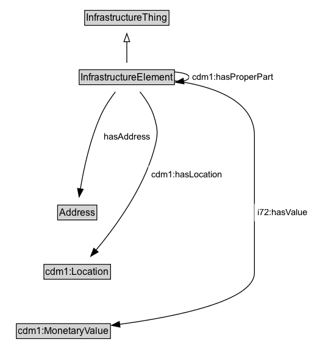

# InfrastructureElement

An Infrastructure Element is a generic representation of a city structure of interest.

## Diagram

=== "SVG (interactive)"

    <!-- Generated by graphviz version 14.1.3 (20260303.0454)
     -->
    <!-- Pages: 1 -->
    <svg width="387pt" height="446pt"
     viewBox="0.00 0.00 387.00 446.00" xmlns="http://www.w3.org/2000/svg" xmlns:xlink="http://www.w3.org/1999/xlink">
    <g id="graph0" class="graph" transform="scale(1 1) rotate(0) translate(4 441.5)">
    <polygon fill="white" stroke="none" points="-4,4 -4,-441.5 382.5,-441.5 382.5,4 -4,4"/>
    <g id="clust3" class="cluster">
    <title>cluster_associated</title>
    </g>
    <!-- InfrastructureThing -->
    <g id="node1" class="node">
    <title>InfrastructureThing</title>
    <g id="a_node1"><a xlink:href="../InfrastructureThing" xlink:title="&lt;TABLE&gt;">
    <polygon fill="lightgray" stroke="none" points="101.12,-411.38 101.12,-427.62 202.88,-427.62 202.88,-411.38 101.12,-411.38"/>
    <text xml:space="preserve" text-anchor="start" x="102.12" y="-415.38" font-family="Arial" font-size="12.00">InfrastructureThing</text>
    <polygon fill="none" stroke="black" points="100.12,-410.38 100.12,-428.62 203.88,-428.62 203.88,-410.38 100.12,-410.38"/>
    </a>
    </g>
    </g>
    <!-- InfrastructureElement -->
    <g id="node2" class="node">
    <title>InfrastructureElement</title>
    <g id="a_node2"><a xlink:href="../InfrastructureElement" xlink:title="&lt;TABLE&gt;">
    <polygon fill="lightgray" stroke="none" points="94.38,-338.38 94.38,-354.62 209.62,-354.62 209.62,-338.38 94.38,-338.38"/>
    <text xml:space="preserve" text-anchor="start" x="95.38" y="-342.38" font-family="Arial" font-size="12.00">InfrastructureElement</text>
    <polygon fill="none" stroke="black" points="93.38,-337.38 93.38,-355.62 210.62,-355.62 210.62,-337.38 93.38,-337.38"/>
    </a>
    </g>
    </g>
    <!-- InfrastructureElement&#45;&gt;InfrastructureThing -->
    <g id="edge1" class="edge">
    <title>InfrastructureElement&#45;&gt;InfrastructureThing</title>
    <path fill="none" stroke="black" d="M152,-364.21C152,-371.97 152,-381.42 152,-390.24"/>
    <polygon fill="none" stroke="black" points="148.5,-390.16 152,-400.16 155.5,-390.16 148.5,-390.16"/>
    </g>
    <!-- InfrastructureElement&#45;&gt;InfrastructureElement -->
    <g id="edge9" class="edge">
    <title>InfrastructureElement&#45;&gt;InfrastructureElement</title>
    <path fill="none" stroke="black" d="M210.47,-352.97C221.14,-352.15 228.62,-349.99 228.62,-346.5 228.62,-344.43 225.99,-342.82 221.61,-341.69"/>
    <polygon fill="black" stroke="black" points="222.37,-338.27 211.96,-340.26 221.34,-345.19 222.37,-338.27"/>
    <polygon fill="white" stroke="none" points="228.62,-335.75 228.62,-357.25 336.38,-357.25 336.38,-335.75 228.62,-335.75"/>
    <text xml:space="preserve" text-anchor="start" x="232.62" y="-342.75" font-family="Arial" font-size="11.00">cdm1:hasProperPart</text>
    </g>
    <!-- Invis -->
    <!-- InfrastructureElement&#45;&gt;Invis -->
    <!-- Address -->
    <g id="node4" class="node">
    <title>Address</title>
    <g id="a_node4"><a xlink:href="../Address" xlink:title="&lt;TABLE&gt;">
    <polygon fill="lightgray" stroke="none" points="67.88,-171.88 67.88,-188.12 114.12,-188.12 114.12,-171.88 67.88,-171.88"/>
    <text xml:space="preserve" text-anchor="start" x="68.88" y="-175.88" font-family="Arial" font-size="12.00">Address</text>
    <polygon fill="none" stroke="black" points="66.88,-170.88 66.88,-189.12 115.12,-189.12 115.12,-170.88 66.88,-170.88"/>
    </a>
    </g>
    </g>
    <!-- InfrastructureElement&#45;&gt;Address -->
    <g id="edge7" class="edge">
    <title>InfrastructureElement&#45;&gt;Address</title>
    <path fill="none" stroke="black" d="M137.92,-328.5C131.65,-320.2 124.64,-309.79 120,-299.5 106.67,-269.97 98.92,-233.42 94.84,-208.78"/>
    <polygon fill="black" stroke="black" points="98.34,-208.57 93.35,-199.22 91.43,-209.64 98.34,-208.57"/>
    <polygon fill="white" stroke="none" points="120,-262.75 120,-284.25 185,-284.25 185,-262.75 120,-262.75"/>
    <text xml:space="preserve" text-anchor="start" x="124" y="-269.75" font-family="Arial" font-size="11.00">hasAddress</text>
    </g>
    <!-- cdm1_Location -->
    <g id="node5" class="node">
    <title>cdm1_Location</title>
    <g id="a_node5"><a xlink:href="https://w3id.org/citydata/part1/v1/Location" xlink:title="&lt;TABLE&gt;">
    <polygon fill="lightgray" stroke="none" points="51,-98.88 51,-115.12 131,-115.12 131,-98.88 51,-98.88"/>
    <text xml:space="preserve" text-anchor="start" x="52" y="-102.88" font-family="Arial" font-size="12.00">cdm1:Location</text>
    <polygon fill="none" stroke="black" points="50,-97.88 50,-116.12 132,-116.12 132,-97.88 50,-97.88"/>
    </a>
    </g>
    </g>
    <!-- InfrastructureElement&#45;&gt;cdm1_Location -->
    <g id="edge8" class="edge">
    <title>InfrastructureElement&#45;&gt;cdm1_Location</title>
    <path fill="none" stroke="black" d="M168.03,-328.59C174.65,-320.46 181.57,-310.17 185,-299.5 190.99,-280.88 190.36,-274.31 185,-255.5 171.47,-208.01 137.2,-161.34 114,-133.6"/>
    <polygon fill="black" stroke="black" points="116.74,-131.43 107.58,-126.1 111.42,-135.98 116.74,-131.43"/>
    <polygon fill="white" stroke="none" points="178.56,-216 178.56,-237.5 273.56,-237.5 273.56,-216 178.56,-216"/>
    <text xml:space="preserve" text-anchor="start" x="182.56" y="-223" font-family="Arial" font-size="11.00">cdm1:hasLocation</text>
    </g>
    <!-- cdm1_MonetaryValue -->
    <g id="node6" class="node">
    <title>cdm1_MonetaryValue</title>
    <g id="a_node6"><a xlink:href="https://w3id.org/citydata/part1/v1/MonetaryValue" xlink:title="&lt;TABLE&gt;">
    <polygon fill="lightgray" stroke="none" points="17.12,-25.88 17.12,-42.12 130.88,-42.12 130.88,-25.88 17.12,-25.88"/>
    <text xml:space="preserve" text-anchor="start" x="18.12" y="-29.88" font-family="Arial" font-size="12.00">cdm1:MonetaryValue</text>
    <polygon fill="none" stroke="black" points="16.12,-24.88 16.12,-43.12 131.88,-43.12 131.88,-24.88 16.12,-24.88"/>
    </a>
    </g>
    </g>
    <!-- InfrastructureElement&#45;&gt;cdm1_MonetaryValue -->
    <g id="edge6" class="edge">
    <title>InfrastructureElement&#45;&gt;cdm1_MonetaryValue</title>
    <path fill="none" stroke="black" d="M210.46,-342.14C255.1,-336.04 309,-319.37 309,-274.5 309,-274.5 309,-274.5 309,-106 309,-71.03 212.42,-51.72 143.09,-42.36"/>
    <polygon fill="black" stroke="black" points="143.66,-38.9 133.29,-41.08 142.75,-45.84 143.66,-38.9"/>
    <polygon fill="white" stroke="none" points="309,-169.25 309,-190.75 378.5,-190.75 378.5,-169.25 309,-169.25"/>
    <text xml:space="preserve" text-anchor="start" x="313" y="-176.25" font-family="Arial" font-size="11.00">i72:hasValue</text>
    </g>
    <!-- Invis&#45;&gt;Address -->
    <!-- Address&#45;&gt;cdm1_Location -->
    <!-- cdm1_Location&#45;&gt;cdm1_MonetaryValue -->
    </g>
    </svg>

=== "PNG"

    

## Specializations of InfrastructureElement

| Class | Description |
|-------|-------------|
| [Bridge](Bridge.md) | A Bridge is a Infrastructure Element that enables travel over some obstacle or area. It may contain some Road Segments or Rail Line Segments. |
| [Bridge Segment](BridgeSegment.md) |  |
| [Building](Building.md) | A Building is a type of Infrastructure Element that is a structure with a roof and walls, such as a house, school, or factory. The location of a Building may change due to construction, but the Parcel/Lot of land it is located on cannot (i.e., moving an entire building results in a change in object instance).  |
| [Building Unit](BuildingUnit.md) | A part of a Building which may be occupied by some Persons or Organization. |
| [Facility](Facility.md) | A facility is a physical location or structure that provides services or amenities to the public or a specific group of people. |
| [Rail Line](RailLine.md) | A Rail Line is a type of Travelled Way that describes a part of the physical transportation infrastructure that has been fitted with tracks to allow travel by trains and other sorts of rail vehicles. No distinction is made between Rail Line types at this level. |
| [Rail Link](RailLink.md) | A Rail Link is a type of Travelled Way Link that represents a length of RailLine. |
| [Rail Segment](RailSegment.md) | A Rail Segment is a type of Travelled Way Segment that represents part of a Rail Link. |
| [Road](Road.md) | A Road is a type of Travelled Way that describes a part of the physical transport infrastructure that has been improved to allow travel by motor vehicles, persons, bicycles, or similar methods of conveyance. road vehicles. No distinction is made between Road types at this level. |
| [Road Link](RoadLink.md) | A Road Link is a type of Travelled Way Link that represents a length of Road. |
| [Road Segment](RoadSegment.md) | A Road Segment is a type of Travelled Way Segment that represents part of a Road Link. |
| [Travelled Way](TravelledWay.md) | A Travelled Way is a type of Infrastructure Element that enables travel. |
| [Travelled Way Link](TravelledWayLink.md) | A Travelled Way Link represents a continuous length of a Travelled Way and is a type of Infrastructure Element that connects two or more Travelled Way Segments. |
| [Travelled Way Segment](TravelledWaySegment.md) | A Travelled Way Segment is a type of Infrastructure Element that represents part of a Travelled Way Link. |
| [Tunnel](Tunnel.md) | A Tunnel is a Infrastructure Element that enables travel through or underneath some obstacle or area. It may contain some Road or RailLine Segments. |
| [Tunnel Segment](TunnelSegment.md) | A Tunnel Segment is a type of Infrastructure Element that represents part of a Tunnel. |

## Formalization for InfrastructureElement

| Property | Constraint |
|----------|------------|
| [cdm1:hasDescription](https://w3id.org/citydata/part1/v1/hasDescription) | datatype xsd:string |
| [cdm1:hasIdentifier](https://w3id.org/citydata/part1/v1/hasIdentifier) | datatype xsd:string |
| [cdm1:hasLocation](https://w3id.org/citydata/part1/v1/hasLocation) | only [cdm1:Location](https://w3id.org/citydata/part1/v1/Location) |
| [cdm1:hasName](https://w3id.org/citydata/part1/v1/hasName) | datatype xsd:string |
| [cdm1:hasProperPart](https://w3id.org/citydata/part1/v1/hasProperPart) | only [InfrastructureElement](https://w3id.org/citydata/part2/v1/InfrastructureElement) |
| [hasAddress](../properties/hasAddress.md) | only [Address](https://w3id.org/citydata/part2/v1/Address) |
| [i72:hasValue](https://w3id.org/citydata/21972/v1/hasValue) | only [cdm1:MonetaryValue](https://w3id.org/citydata/part1/v1/MonetaryValue) |
| subClassOf | [InfrastructureThing](InfrastructureThing.md) |

