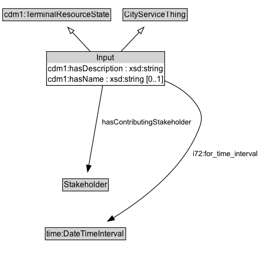

# Input

Input defines the resources and the stakeholders that are needed for an Activity.

## Diagram

=== "SVG (interactive)"

    <!-- Generated by graphviz version 14.1.3 (20260303.0454)
     -->
    <!-- Pages: 1 -->
    <svg width="393pt" height="387pt"
     viewBox="0.00 0.00 393.00 387.00" xmlns="http://www.w3.org/2000/svg" xmlns:xlink="http://www.w3.org/1999/xlink">
    <g id="graph0" class="graph" transform="scale(1 1) rotate(0) translate(4 383.25)">
    <polygon fill="white" stroke="none" points="-4,4 -4,-383.25 388.95,-383.25 388.95,4 -4,4"/>
    <g id="clust3" class="cluster">
    <title>cluster_associated</title>
    </g>
    <!-- cdm1_TerminalResourceState -->
    <g id="node1" class="node">
    <title>cdm1_TerminalResourceState</title>
    <g id="a_node1"><a xlink:href="https://w3id.org/citydata/part1/v1/TerminalResourceState" xlink:title="&lt;TABLE&gt;">
    <polygon fill="lightgray" stroke="none" points="1,-353.12 1,-369.38 160.5,-369.38 160.5,-353.12 1,-353.12"/>
    <text xml:space="preserve" text-anchor="start" x="2" y="-357.12" font-family="Arial" font-size="12.00">cdm1:TerminalResourceState</text>
    <polygon fill="none" stroke="black" points="0,-352.12 0,-370.38 161.5,-370.38 161.5,-352.12 0,-352.12"/>
    </a>
    </g>
    </g>
    <!-- CityServiceThing -->
    <g id="node2" class="node">
    <title>CityServiceThing</title>
    <g id="a_node2"><a xlink:href="../CityServiceThing" xlink:title="&lt;TABLE&gt;">
    <polygon fill="lightgray" stroke="none" points="180.62,-353.12 180.62,-369.38 274.88,-369.38 274.88,-353.12 180.62,-353.12"/>
    <text xml:space="preserve" text-anchor="start" x="181.62" y="-357.12" font-family="Arial" font-size="12.00">CityServiceThing</text>
    <polygon fill="none" stroke="black" points="179.62,-352.12 179.62,-370.38 275.88,-370.38 275.88,-352.12 179.62,-352.12"/>
    </a>
    </g>
    </g>
    <!-- Input -->
    <g id="node3" class="node">
    <title>Input</title>
    <g id="a_node3"><a xlink:href="../Input" xlink:title="&lt;TABLE&gt;">
    <polygon fill="lightgray" stroke="none" points="66.5,-289 66.5,-305.25 241,-305.25 241,-289 66.5,-289"/>
    <text xml:space="preserve" text-anchor="start" x="140.62" y="-293" font-family="Arial" font-size="12.00">Input</text>
    <text xml:space="preserve" text-anchor="start" x="67.5" y="-276.75" font-family="Arial" font-size="12.00">cdm1:hasDescription : xsd:string</text>
    <text xml:space="preserve" text-anchor="start" x="67.5" y="-260.5" font-family="Arial" font-size="12.00">cdm1:hasName : xsd:string [0..1]</text>
    <polygon fill="none" stroke="black" points="65.5,-255.5 65.5,-306.25 242,-306.25 242,-255.5 65.5,-255.5"/>
    </a>
    </g>
    </g>
    <!-- Input&#45;&gt;cdm1_TerminalResourceState -->
    <g id="edge1" class="edge">
    <title>Input&#45;&gt;cdm1_TerminalResourceState</title>
    <path fill="none" stroke="black" d="M131.08,-306.21C122.42,-315.52 112.53,-326.13 103.82,-335.48"/>
    <polygon fill="none" stroke="black" points="101.52,-332.82 97.26,-342.52 106.64,-337.59 101.52,-332.82"/>
    </g>
    <!-- Input&#45;&gt;CityServiceThing -->
    <g id="edge2" class="edge">
    <title>Input&#45;&gt;CityServiceThing</title>
    <path fill="none" stroke="black" d="M176.73,-306.21C185.51,-315.52 195.54,-326.13 204.36,-335.48"/>
    <polygon fill="none" stroke="black" points="201.61,-337.66 211.02,-342.53 206.7,-332.85 201.61,-337.66"/>
    </g>
    <!-- Invis -->
    <!-- Input&#45;&gt;Invis -->
    <!-- Stakeholder -->
    <g id="node5" class="node">
    <title>Stakeholder</title>
    <g id="a_node5"><a xlink:href="../Stakeholder" xlink:title="&lt;TABLE&gt;">
    <polygon fill="lightgray" stroke="none" points="90.5,-98.88 90.5,-115.12 157,-115.12 157,-98.88 90.5,-98.88"/>
    <text xml:space="preserve" text-anchor="start" x="91.5" y="-102.88" font-family="Arial" font-size="12.00">Stakeholder</text>
    <polygon fill="none" stroke="black" points="89.5,-97.88 89.5,-116.12 158,-116.12 158,-97.88 89.5,-97.88"/>
    </a>
    </g>
    </g>
    <!-- Input&#45;&gt;Stakeholder -->
    <g id="edge6" class="edge">
    <title>Input&#45;&gt;Stakeholder</title>
    <path fill="none" stroke="black" d="M149.52,-255.61C144.02,-224.13 134.45,-169.31 128.65,-136.07"/>
    <polygon fill="black" stroke="black" points="132.12,-135.62 126.96,-126.37 125.23,-136.82 132.12,-135.62"/>
    <polygon fill="white" stroke="none" points="144.37,-189.75 144.37,-211.25 285.87,-211.25 285.87,-189.75 144.37,-189.75"/>
    <text xml:space="preserve" text-anchor="start" x="148.37" y="-196.75" font-family="Arial" font-size="11.00">hasContributingStakeholder</text>
    </g>
    <!-- time_DateTimeInterval -->
    <g id="node6" class="node">
    <title>time_DateTimeInterval</title>
    <g id="a_node6"><a xlink:href="https://w3id.org/citydata/imported/time/latest/DateTimeInterval" xlink:title="&lt;TABLE&gt;">
    <polygon fill="lightgray" stroke="none" points="64.62,-25.88 64.62,-42.12 182.88,-42.12 182.88,-25.88 64.62,-25.88"/>
    <text xml:space="preserve" text-anchor="start" x="65.62" y="-29.88" font-family="Arial" font-size="12.00">time:DateTimeInterval</text>
    <polygon fill="none" stroke="black" points="63.62,-24.88 63.62,-43.12 183.88,-43.12 183.88,-24.88 63.62,-24.88"/>
    </a>
    </g>
    </g>
    <!-- Input&#45;&gt;time_DateTimeInterval -->
    <g id="edge7" class="edge">
    <title>Input&#45;&gt;time_DateTimeInterval</title>
    <path fill="none" stroke="black" d="M242,-262.65C260.75,-254.77 278.32,-243.27 289.75,-226.5 300.77,-210.34 297.76,-200.34 289.75,-182.5 264.41,-126.09 205.65,-82.46 165.3,-57.74"/>
    <polygon fill="black" stroke="black" points="167.15,-54.77 156.77,-52.65 163.56,-60.78 167.15,-54.77"/>
    <polygon fill="white" stroke="none" points="280.2,-143 280.2,-164.5 384.95,-164.5 384.95,-143 280.2,-143"/>
    <text xml:space="preserve" text-anchor="start" x="284.2" y="-150" font-family="Arial" font-size="11.00">i72:for_time_interval</text>
    </g>
    <!-- Invis&#45;&gt;Stakeholder -->
    <!-- Stakeholder&#45;&gt;time_DateTimeInterval -->
    </g>
    </svg>

=== "PNG"

    

## Formalization for Input

| Property | Constraint |
|----------|------------|
| [cdm1:hasDescription](https://w3id.org/citydata/part1/v1/hasDescription) | datatype xsd:string |
| [cdm1:hasName](https://w3id.org/citydata/part1/v1/hasName) | max 1 |
| [cdm1:hasName](https://w3id.org/citydata/part1/v1/hasName) | max 1 xsd:string |
| [hasContributingStakeholder](../properties/hasContributingStakeholder.md) | only [Stakeholder](https://w3id.org/citydata/part2/v1/Stakeholder) |
| [i72:for_time_interval](https://w3id.org/citydata/21972/v1/for_time_interval) | only [time:DateTimeInterval](http://www.w3.org/2006/time#DateTimeInterval) |
| subClassOf | [cdm1:TerminalResourceState](https://w3id.org/citydata/part1/v1/TerminalResourceState) |
| subClassOf | [CityServiceThing](CityServiceThing.md) |

