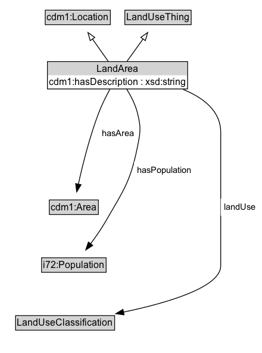

# LandArea

A Land Area is a defined geographic area of land.

## Diagram

=== "SVG (interactive)"

    <!-- Generated by graphviz version 14.1.3 (20260303.0454)
     -->
    <!-- Pages: 1 -->
    <svg width="330pt" height="446pt"
     viewBox="0.00 0.00 330.00 446.00" xmlns="http://www.w3.org/2000/svg" xmlns:xlink="http://www.w3.org/1999/xlink">
    <g id="graph0" class="graph" transform="scale(1 1) rotate(0) translate(4 441.5)">
    <polygon fill="white" stroke="none" points="-4,4 -4,-441.5 325.75,-441.5 325.75,4 -4,4"/>
    <g id="clust3" class="cluster">
    <title>cluster_associated</title>
    </g>
    <!-- cdm1_Location -->
    <g id="node1" class="node">
    <title>cdm1_Location</title>
    <g id="a_node1"><a xlink:href="https://w3id.org/citydata/part1/v1/Location" xlink:title="&lt;TABLE&gt;">
    <polygon fill="lightgray" stroke="none" points="54,-411.38 54,-427.62 134,-427.62 134,-411.38 54,-411.38"/>
    <text xml:space="preserve" text-anchor="start" x="55" y="-415.38" font-family="Arial" font-size="12.00">cdm1:Location</text>
    <polygon fill="none" stroke="black" points="53,-410.38 53,-428.62 135,-428.62 135,-410.38 53,-410.38"/>
    </a>
    </g>
    </g>
    <!-- LandUseThing -->
    <g id="node2" class="node">
    <title>LandUseThing</title>
    <g id="a_node2"><a xlink:href="../LandUseThing" xlink:title="&lt;TABLE&gt;">
    <polygon fill="lightgray" stroke="none" points="154.25,-411.38 154.25,-427.62 235.75,-427.62 235.75,-411.38 154.25,-411.38"/>
    <text xml:space="preserve" text-anchor="start" x="155.25" y="-415.38" font-family="Arial" font-size="12.00">LandUseThing</text>
    <polygon fill="none" stroke="black" points="153.25,-410.38 153.25,-428.62 236.75,-428.62 236.75,-410.38 153.25,-410.38"/>
    </a>
    </g>
    </g>
    <!-- LandArea -->
    <g id="node3" class="node">
    <title>LandArea</title>
    <g id="a_node3"><a xlink:href="../LandArea" xlink:title="&lt;TABLE&gt;">
    <polygon fill="lightgray" stroke="none" points="56.75,-346.5 56.75,-362.75 231.25,-362.75 231.25,-346.5 56.75,-346.5"/>
    <text xml:space="preserve" text-anchor="start" x="117.75" y="-350.5" font-family="Arial" font-size="12.00">LandArea</text>
    <text xml:space="preserve" text-anchor="start" x="57.75" y="-334.25" font-family="Arial" font-size="12.00">cdm1:hasDescription : xsd:string</text>
    <polygon fill="none" stroke="black" points="55.75,-329.25 55.75,-363.75 232.25,-363.75 232.25,-329.25 55.75,-329.25"/>
    </a>
    </g>
    </g>
    <!-- LandArea&#45;&gt;cdm1_Location -->
    <g id="edge1" class="edge">
    <title>LandArea&#45;&gt;cdm1_Location</title>
    <path fill="none" stroke="black" d="M132.24,-364.21C126.33,-372.59 119.05,-382.93 112.43,-392.34"/>
    <polygon fill="none" stroke="black" points="109.62,-390.25 106.72,-400.44 115.34,-394.28 109.62,-390.25"/>
    </g>
    <!-- LandArea&#45;&gt;LandUseThing -->
    <g id="edge2" class="edge">
    <title>LandArea&#45;&gt;LandUseThing</title>
    <path fill="none" stroke="black" d="M156,-364.21C162.02,-372.59 169.45,-382.93 176.21,-392.34"/>
    <polygon fill="none" stroke="black" points="173.35,-394.36 182.03,-400.44 179.04,-390.28 173.35,-394.36"/>
    </g>
    <!-- Invis -->
    <!-- LandArea&#45;&gt;Invis -->
    <!-- cdm1_Area -->
    <g id="node5" class="node">
    <title>cdm1_Area</title>
    <g id="a_node5"><a xlink:href="https://w3id.org/citydata/part1/v1/Area" xlink:title="&lt;TABLE&gt;">
    <polygon fill="lightgray" stroke="none" points="59.12,-171.88 59.12,-188.12 118.88,-188.12 118.88,-171.88 59.12,-171.88"/>
    <text xml:space="preserve" text-anchor="start" x="60.12" y="-175.88" font-family="Arial" font-size="12.00">cdm1:Area</text>
    <polygon fill="none" stroke="black" points="58.12,-170.88 58.12,-189.12 119.88,-189.12 119.88,-170.88 58.12,-170.88"/>
    </a>
    </g>
    </g>
    <!-- LandArea&#45;&gt;cdm1_Area -->
    <g id="edge8" class="edge">
    <title>LandArea&#45;&gt;cdm1_Area</title>
    <path fill="none" stroke="black" d="M134.41,-328.85C129.76,-320.28 124.35,-309.55 120.5,-299.5 108.91,-269.27 99.97,-233.12 94.63,-208.77"/>
    <polygon fill="black" stroke="black" points="98.12,-208.37 92.61,-199.32 91.27,-209.83 98.12,-208.37"/>
    <polygon fill="white" stroke="none" points="120.5,-262.75 120.5,-284.25 169,-284.25 169,-262.75 120.5,-262.75"/>
    <text xml:space="preserve" text-anchor="start" x="124.5" y="-269.75" font-family="Arial" font-size="11.00">hasArea</text>
    </g>
    <!-- i72_Population -->
    <g id="node6" class="node">
    <title>i72_Population</title>
    <g id="a_node6"><a xlink:href="https://w3id.org/citydata/21972/v1/Population" xlink:title="&lt;TABLE&gt;">
    <polygon fill="lightgray" stroke="none" points="49.38,-98.88 49.38,-115.12 128.62,-115.12 128.62,-98.88 49.38,-98.88"/>
    <text xml:space="preserve" text-anchor="start" x="50.38" y="-102.88" font-family="Arial" font-size="12.00">i72:Population</text>
    <polygon fill="none" stroke="black" points="48.38,-97.88 48.38,-116.12 129.62,-116.12 129.62,-97.88 48.38,-97.88"/>
    </a>
    </g>
    </g>
    <!-- LandArea&#45;&gt;i72_Population -->
    <g id="edge9" class="edge">
    <title>LandArea&#45;&gt;i72_Population</title>
    <path fill="none" stroke="black" d="M155.66,-328.87C160.84,-320.48 166.36,-309.89 169,-299.5 173.82,-280.55 172.93,-274.66 169,-255.5 159.93,-211.22 151.49,-201.2 129,-162 123.46,-152.34 116.49,-142.37 109.92,-133.67"/>
    <polygon fill="black" stroke="black" points="112.87,-131.76 103.97,-126 107.33,-136.05 112.87,-131.76"/>
    <polygon fill="white" stroke="none" points="164.8,-216 164.8,-237.5 241.05,-237.5 241.05,-216 164.8,-216"/>
    <text xml:space="preserve" text-anchor="start" x="168.8" y="-223" font-family="Arial" font-size="11.00">hasPopulation</text>
    </g>
    <!-- LandUseClassification -->
    <g id="node7" class="node">
    <title>LandUseClassification</title>
    <g id="a_node7"><a xlink:href="../LandUseClassification" xlink:title="&lt;TABLE&gt;">
    <polygon fill="lightgray" stroke="none" points="16.62,-25.88 16.62,-42.12 139.38,-42.12 139.38,-25.88 16.62,-25.88"/>
    <text xml:space="preserve" text-anchor="start" x="17.62" y="-29.88" font-family="Arial" font-size="12.00">LandUseClassification</text>
    <polygon fill="none" stroke="black" points="15.62,-24.88 15.62,-43.12 140.38,-43.12 140.38,-24.88 15.62,-24.88"/>
    </a>
    </g>
    </g>
    <!-- LandArea&#45;&gt;LandUseClassification -->
    <g id="edge7" class="edge">
    <title>LandArea&#45;&gt;LandUseClassification</title>
    <path fill="none" stroke="black" d="M226.7,-328.57C252.34,-318.14 274,-301.37 274,-274.5 274,-274.5 274,-274.5 274,-106 274,-78.9 206.92,-59.21 151.24,-47.53"/>
    <polygon fill="black" stroke="black" points="152.26,-44.17 141.77,-45.6 150.87,-51.03 152.26,-44.17"/>
    <polygon fill="white" stroke="none" points="274,-169.25 274,-190.75 321.75,-190.75 321.75,-169.25 274,-169.25"/>
    <text xml:space="preserve" text-anchor="start" x="278" y="-176.25" font-family="Arial" font-size="11.00">landUse</text>
    </g>
    <!-- Invis&#45;&gt;cdm1_Area -->
    <!-- cdm1_Area&#45;&gt;i72_Population -->
    <!-- i72_Population&#45;&gt;LandUseClassification -->
    </g>
    </svg>

=== "PNG"

    

## Formalization for LandArea

| Property | Constraint |
|----------|------------|
| [cdm1:hasDescription](https://w3id.org/citydata/part1/v1/hasDescription) | datatype xsd:string |
| [hasArea](../properties/hasArea.md) | only [cdm1:Area](https://w3id.org/citydata/part1/v1/Area) |
| [hasPopulation](../properties/hasPopulation.md) | only [i72:Population](https://w3id.org/citydata/21972/v1/Population) |
| [landUse](../properties/landUse.md) | only [LandUseClassification](https://w3id.org/citydata/part2/v1/LandUseClassification) |
| subClassOf | [cdm1:Location](https://w3id.org/citydata/part1/v1/Location) |
| subClassOf | [LandUseThing](LandUseThing.md) |

