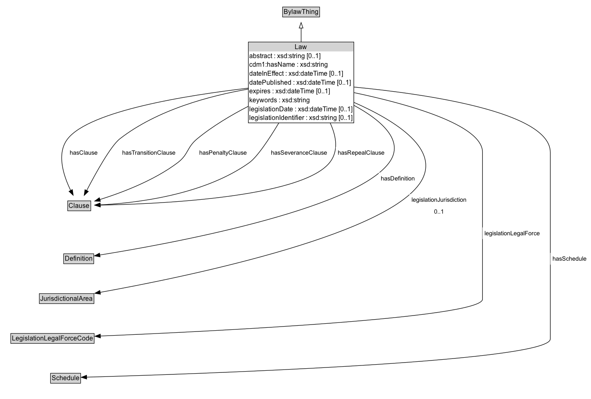

# Law

A Law is an legally enforceable rule.

## Diagram

=== "SVG (interactive)"

    <!-- Generated by graphviz version 14.1.3 (20260303.0454)
     -->
    <!-- Pages: 1 -->
    <svg width="1081pt" height="731pt"
     viewBox="0.00 0.00 1081.00 731.00" xmlns="http://www.w3.org/2000/svg" xmlns:xlink="http://www.w3.org/1999/xlink">
    <g id="graph0" class="graph" transform="scale(1 1) rotate(0) translate(4 727.25)">
    <polygon fill="white" stroke="none" points="-4,4 -4,-727.25 1077.25,-727.25 1077.25,4 -4,4"/>
    <g id="clust3" class="cluster">
    <title>cluster_associated</title>
    </g>
    <!-- BylawThing -->
    <g id="node1" class="node">
    <title>BylawThing</title>
    <g id="a_node1"><a xlink:href="../BylawThing" xlink:title="&lt;TABLE&gt;">
    <polygon fill="lightgray" stroke="none" points="514.12,-697.12 514.12,-713.38 579.88,-713.38 579.88,-697.12 514.12,-697.12"/>
    <text xml:space="preserve" text-anchor="start" x="515.12" y="-701.12" font-family="Arial" font-size="12.00">BylawThing</text>
    <polygon fill="none" stroke="black" points="513.12,-696.12 513.12,-714.38 580.88,-714.38 580.88,-696.12 513.12,-696.12"/>
    </a>
    </g>
    </g>
    <!-- Law -->
    <g id="node2" class="node">
    <title>Law</title>
    <g id="a_node2"><a xlink:href="../Law" xlink:title="&lt;TABLE&gt;">
    <polygon fill="lightgray" stroke="none" points="451.5,-633 451.5,-649.25 642.5,-649.25 642.5,-633 451.5,-633"/>
    <text xml:space="preserve" text-anchor="start" x="535.75" y="-637" font-family="Arial" font-size="12.00">Law</text>
    <text xml:space="preserve" text-anchor="start" x="452.5" y="-620.75" font-family="Arial" font-size="12.00">abstract : xsd:string [0..1]</text>
    <text xml:space="preserve" text-anchor="start" x="452.5" y="-604.5" font-family="Arial" font-size="12.00">cdm1:hasName : xsd:string</text>
    <text xml:space="preserve" text-anchor="start" x="452.5" y="-588.25" font-family="Arial" font-size="12.00">dateInEffect : xsd:dateTime [0..1]</text>
    <text xml:space="preserve" text-anchor="start" x="452.5" y="-572" font-family="Arial" font-size="12.00">datePublished : xsd:dateTime [0..1]</text>
    <text xml:space="preserve" text-anchor="start" x="452.5" y="-555.75" font-family="Arial" font-size="12.00">expires : xsd:dateTime [0..1]</text>
    <text xml:space="preserve" text-anchor="start" x="452.5" y="-539.5" font-family="Arial" font-size="12.00">keywords : xsd:string</text>
    <text xml:space="preserve" text-anchor="start" x="452.5" y="-523.25" font-family="Arial" font-size="12.00">legislationDate : xsd:dateTime [0..1]</text>
    <text xml:space="preserve" text-anchor="start" x="452.5" y="-507" font-family="Arial" font-size="12.00">legislationIdentifier : xsd:string [0..1]</text>
    <polygon fill="none" stroke="black" points="450.5,-502 450.5,-650.25 643.5,-650.25 643.5,-502 450.5,-502"/>
    </a>
    </g>
    </g>
    <!-- Law&#45;&gt;BylawThing -->
    <g id="edge1" class="edge">
    <title>Law&#45;&gt;BylawThing</title>
    <path fill="none" stroke="black" d="M547,-650.19C547,-659.33 547,-668.21 547,-676.04"/>
    <polygon fill="none" stroke="black" points="543.5,-675.86 547,-685.86 550.5,-675.86 543.5,-675.86"/>
    </g>
    <!-- Invis -->
    <!-- Law&#45;&gt;Invis -->
    <!-- Clause -->
    <g id="node4" class="node">
    <title>Clause</title>
    <g id="a_node4"><a xlink:href="../Clause" xlink:title="&lt;TABLE&gt;">
    <polygon fill="lightgray" stroke="none" points="120.88,-341.88 120.88,-358.12 161.12,-358.12 161.12,-341.88 120.88,-341.88"/>
    <text xml:space="preserve" text-anchor="start" x="121.88" y="-345.88" font-family="Arial" font-size="12.00">Clause</text>
    <polygon fill="none" stroke="black" points="119.88,-340.88 119.88,-359.12 162.12,-359.12 162.12,-340.88 119.88,-340.88"/>
    </a>
    </g>
    </g>
    <!-- Law&#45;&gt;Clause -->
    <g id="edge9" class="edge">
    <title>Law&#45;&gt;Clause</title>
    <path fill="none" stroke="black" d="M450.88,-565.8C337.84,-552.62 160.43,-524.24 120,-473 98.61,-445.89 112.34,-404.75 125.53,-377.87"/>
    <polygon fill="black" stroke="black" points="128.47,-379.82 129.98,-369.33 122.26,-376.59 128.47,-379.82"/>
    <polygon fill="white" stroke="none" points="120,-436.25 120,-457.75 179,-457.75 179,-436.25 120,-436.25"/>
    <text xml:space="preserve" text-anchor="start" x="124" y="-443.25" font-family="Arial" font-size="11.00">hasClause</text>
    </g>
    <!-- Law&#45;&gt;Clause -->
    <g id="edge13" class="edge">
    <title>Law&#45;&gt;Clause</title>
    <path fill="none" stroke="black" d="M450.74,-564.02C379.63,-551.7 283.73,-526.03 215.5,-473 198.69,-459.93 170.94,-409.57 154.47,-377.78"/>
    <polygon fill="black" stroke="black" points="157.72,-376.44 150.04,-369.14 151.49,-379.63 157.72,-376.44"/>
    <polygon fill="white" stroke="none" points="215.5,-436.25 215.5,-457.75 321,-457.75 321,-436.25 215.5,-436.25"/>
    <text xml:space="preserve" text-anchor="start" x="219.5" y="-443.25" font-family="Arial" font-size="11.00">hasTransitionClause</text>
    </g>
    <!-- Law&#45;&gt;Clause -->
    <g id="edge14" class="edge">
    <title>Law&#45;&gt;Clause</title>
    <path fill="none" stroke="black" d="M450.61,-532.61C419.1,-516.35 385.04,-496.1 357,-473 337.5,-456.93 341.16,-444.23 321,-429 277.1,-395.83 216.92,-373.46 178.5,-361.47"/>
    <polygon fill="black" stroke="black" points="179.82,-358.22 169.24,-358.66 177.79,-364.92 179.82,-358.22"/>
    <polygon fill="white" stroke="none" points="357,-436.25 357,-457.75 452,-457.75 452,-436.25 357,-436.25"/>
    <text xml:space="preserve" text-anchor="start" x="361" y="-443.25" font-family="Arial" font-size="11.00">hasPenaltyClause</text>
    </g>
    <!-- Law&#45;&gt;Clause -->
    <g id="edge15" class="edge">
    <title>Law&#45;&gt;Clause</title>
    <path fill="none" stroke="black" d="M506.37,-502.16C487.67,-470.96 466.47,-439.33 452,-429 367.73,-368.83 241.73,-354.92 179.13,-351.81"/>
    <polygon fill="black" stroke="black" points="179.5,-348.32 169.36,-351.4 179.2,-355.32 179.5,-348.32"/>
    <polygon fill="white" stroke="none" points="487.83,-436.25 487.83,-457.75 598.58,-457.75 598.58,-436.25 487.83,-436.25"/>
    <text xml:space="preserve" text-anchor="start" x="491.83" y="-443.25" font-family="Arial" font-size="11.00">hasSeveranceClause</text>
    </g>
    <!-- Law&#45;&gt;Clause -->
    <g id="edge16" class="edge">
    <title>Law&#45;&gt;Clause</title>
    <path fill="none" stroke="black" d="M600.09,-502.17C611.66,-477.08 616.02,-450.04 599,-429 546.53,-364.15 279.86,-353.17 179.37,-351.35"/>
    <polygon fill="black" stroke="black" points="179.54,-347.85 169.48,-351.19 179.43,-354.85 179.54,-347.85"/>
    <polygon fill="white" stroke="none" points="610.3,-436.25 610.3,-457.75 703.8,-457.75 703.8,-436.25 610.3,-436.25"/>
    <text xml:space="preserve" text-anchor="start" x="614.3" y="-443.25" font-family="Arial" font-size="11.00">hasRepealClause</text>
    </g>
    <!-- Definition -->
    <g id="node5" class="node">
    <title>Definition</title>
    <g id="a_node5"><a xlink:href="../Definition" xlink:title="&lt;TABLE&gt;">
    <polygon fill="lightgray" stroke="none" points="113.5,-244.88 113.5,-261.12 166.5,-261.12 166.5,-244.88 113.5,-244.88"/>
    <text xml:space="preserve" text-anchor="start" x="114.5" y="-248.88" font-family="Arial" font-size="12.00">Definition</text>
    <polygon fill="none" stroke="black" points="112.5,-243.88 112.5,-262.12 167.5,-262.12 167.5,-243.88 112.5,-243.88"/>
    </a>
    </g>
    </g>
    <!-- Law&#45;&gt;Definition -->
    <g id="edge10" class="edge">
    <title>Law&#45;&gt;Definition</title>
    <path fill="none" stroke="black" d="M643.44,-534.31C693.2,-507.25 737.82,-469.39 708,-429 642.97,-340.92 295.45,-278.61 178.46,-259.88"/>
    <polygon fill="black" stroke="black" points="179.16,-256.45 168.74,-258.34 178.07,-263.36 179.16,-256.45"/>
    <polygon fill="white" stroke="none" points="689.06,-389.5 689.06,-411 759.31,-411 759.31,-389.5 689.06,-389.5"/>
    <text xml:space="preserve" text-anchor="start" x="693.06" y="-396.5" font-family="Arial" font-size="11.00">hasDefinition</text>
    </g>
    <!-- JurisdictionalArea -->
    <g id="node6" class="node">
    <title>JurisdictionalArea</title>
    <g id="a_node6"><a xlink:href="../JurisdictionalArea" xlink:title="&lt;TABLE&gt;">
    <polygon fill="lightgray" stroke="none" points="69,-171.88 69,-188.12 167,-188.12 167,-171.88 69,-171.88"/>
    <text xml:space="preserve" text-anchor="start" x="70" y="-175.88" font-family="Arial" font-size="12.00">JurisdictionalArea</text>
    <polygon fill="none" stroke="black" points="68,-170.88 68,-189.12 168,-189.12 168,-170.88 68,-170.88"/>
    </a>
    </g>
    </g>
    <!-- Law&#45;&gt;JurisdictionalArea -->
    <g id="edge11" class="edge">
    <title>Law&#45;&gt;JurisdictionalArea</title>
    <path fill="none" stroke="black" d="M643.47,-539.72C720.19,-505.96 807.79,-451.23 763,-389.5 692.61,-292.49 325.88,-217.86 178.96,-191.41"/>
    <polygon fill="black" stroke="black" points="179.89,-188.02 169.43,-189.7 178.65,-194.91 179.89,-188.02"/>
    <polygon fill="white" stroke="none" points="745.17,-328.5 745.17,-371.5 853.67,-371.5 853.67,-328.5 745.17,-328.5"/>
    <text xml:space="preserve" text-anchor="start" x="749.17" y="-357" font-family="Arial" font-size="11.00">legislationJurisdiction</text>
    <text xml:space="preserve" text-anchor="start" x="790.42" y="-335.5" font-family="Arial" font-size="11.00">0..1</text>
    </g>
    <!-- LegislationLegalForceCode -->
    <g id="node7" class="node">
    <title>LegislationLegalForceCode</title>
    <g id="a_node7"><a xlink:href="../LegislationLegalForceCode" xlink:title="&lt;TABLE&gt;">
    <polygon fill="lightgray" stroke="none" points="16.75,-98.88 16.75,-115.12 167.25,-115.12 167.25,-98.88 16.75,-98.88"/>
    <text xml:space="preserve" text-anchor="start" x="17.75" y="-102.88" font-family="Arial" font-size="12.00">LegislationLegalForceCode</text>
    <polygon fill="none" stroke="black" points="15.75,-97.88 15.75,-116.12 168.25,-116.12 168.25,-97.88 15.75,-97.88"/>
    </a>
    </g>
    </g>
    <!-- Law&#45;&gt;LegislationLegalForceCode -->
    <g id="edge12" class="edge">
    <title>Law&#45;&gt;LegislationLegalForceCode</title>
    <path fill="none" stroke="black" d="M643.47,-557.56C741.5,-536.9 879,-498.84 879,-448 879,-448 879,-448 879,-179 879,-144.2 384.55,-119.96 179.49,-111.4"/>
    <polygon fill="black" stroke="black" points="179.82,-107.92 169.69,-111 179.53,-114.91 179.82,-107.92"/>
    <polygon fill="white" stroke="none" points="879,-289 879,-310.5 988.25,-310.5 988.25,-289 879,-289"/>
    <text xml:space="preserve" text-anchor="start" x="883" y="-296" font-family="Arial" font-size="11.00">legislationLegalForce</text>
    </g>
    <!-- Schedule -->
    <g id="node8" class="node">
    <title>Schedule</title>
    <g id="a_node8"><a xlink:href="../Schedule" xlink:title="&lt;TABLE&gt;">
    <polygon fill="lightgray" stroke="none" points="89.5,-25.88 89.5,-42.12 142.5,-42.12 142.5,-25.88 89.5,-25.88"/>
    <text xml:space="preserve" text-anchor="start" x="90.5" y="-29.88" font-family="Arial" font-size="12.00">Schedule</text>
    <polygon fill="none" stroke="black" points="88.5,-24.88 88.5,-43.12 143.5,-43.12 143.5,-24.88 88.5,-24.88"/>
    </a>
    </g>
    </g>
    <!-- Law&#45;&gt;Schedule -->
    <g id="edge8" class="edge">
    <title>Law&#45;&gt;Schedule</title>
    <path fill="none" stroke="black" d="M643.43,-567.75C777.25,-554.81 1003,-522.02 1003,-448 1003,-448 1003,-448 1003,-106 1003,-62.77 324.64,-40.85 154.39,-36.03"/>
    <polygon fill="black" stroke="black" points="154.64,-32.54 144.54,-35.76 154.44,-39.53 154.64,-32.54"/>
    <polygon fill="white" stroke="none" points="1003,-242.25 1003,-263.75 1073.25,-263.75 1073.25,-242.25 1003,-242.25"/>
    <text xml:space="preserve" text-anchor="start" x="1007" y="-249.25" font-family="Arial" font-size="11.00">hasSchedule</text>
    </g>
    <!-- Invis&#45;&gt;Clause -->
    <!-- Clause&#45;&gt;Definition -->
    <!-- Definition&#45;&gt;JurisdictionalArea -->
    <!-- JurisdictionalArea&#45;&gt;LegislationLegalForceCode -->
    <!-- LegislationLegalForceCode&#45;&gt;Schedule -->
    </g>
    </svg>

=== "PNG"

    

## Specializations of Law

| Class | Description |
|-------|-------------|
| [Amending Bylaw](AmendingBylaw.md) | An Amending Bylaw is a type of Bylaw that modifies or updates an existing bylaw. |
| [Bylaw](Bylaw.md) | A bylaw is a law that is passed by a lower hierarchical entity that gains its authority from a government authority. |
| [Main Bylaw](MainBylaw.md) | A Main Bylaw is a legally enforceable rule that serves as the primary legislative document for a law within a Jurisdictional Area. |
| [Revision Bylaw](RevisionBylaw.md) | A RevisionBylaw is a bylaw that amends an existing bylaw. |

## Formalization for Law

| Property | Constraint |
|----------|------------|
| [abstract](../properties/abstract.md) | max 1 |
| [abstract](../properties/abstract.md) | max 1 xsd:string |
| [cdm1:hasName](https://w3id.org/citydata/part1/v1/hasName) | datatype xsd:string |
| [dateInEffect](../properties/dateInEffect.md) | max 1 |
| [dateInEffect](../properties/dateInEffect.md) | max 1 xsd:dateTime |
| [datePublished](../properties/datePublished.md) | max 1 |
| [datePublished](../properties/datePublished.md) | max 1 xsd:dateTime |
| [expires](../properties/expires.md) | max 1 |
| [expires](../properties/expires.md) | max 1 xsd:dateTime |
| [hasClause](../properties/hasClause.md) | only [Clause](https://w3id.org/citydata/part2/v1/Clause) |
| [hasDefinition](../properties/hasDefinition.md) | only [Definition](https://w3id.org/citydata/part2/v1/Definition) |
| [hasPenaltyClause](../properties/hasPenaltyClause.md) | only [Clause](https://w3id.org/citydata/part2/v1/Clause) |
| [hasRepealClause](../properties/hasRepealClause.md) | only [Clause](https://w3id.org/citydata/part2/v1/Clause) |
| [hasSchedule](../properties/hasSchedule.md) | only [Schedule](https://w3id.org/citydata/part2/v1/Schedule) |
| [hasSeveranceClause](../properties/hasSeveranceClause.md) | only [Clause](https://w3id.org/citydata/part2/v1/Clause) |
| [hasTransitionClause](../properties/hasTransitionClause.md) | only [Clause](https://w3id.org/citydata/part2/v1/Clause) |
| [keywords](../properties/keywords.md) | datatype xsd:string |
| [legislationDate](../properties/legislationDate.md) | max 1 |
| [legislationDate](../properties/legislationDate.md) | max 1 xsd:dateTime |
| [legislationIdentifier](../properties/legislationIdentifier.md) | max 1 |
| [legislationIdentifier](../properties/legislationIdentifier.md) | max 1 xsd:string |
| [legislationJurisdiction](../properties/legislationJurisdiction.md) | max 1 |
| [legislationJurisdiction](../properties/legislationJurisdiction.md) | max 1 [JurisdictionalArea](https://w3id.org/citydata/part2/v1/JurisdictionalArea) |
| [legislationLegalForce](../properties/legislationLegalForce.md) | only [LegislationLegalForceCode](https://w3id.org/citydata/part2/v1/LegislationLegalForceCode) |
| subClassOf | [BylawThing](BylawThing.md) |

