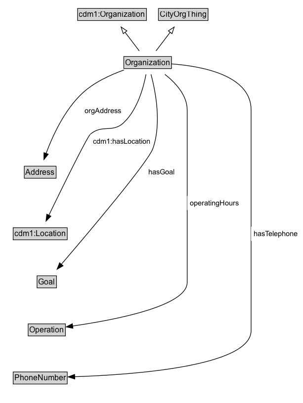

# Organization

An Organization defined broadly as a formal or semi-formal group for which structure and behaviour are defined.

## Diagram

=== "SVG (interactive)"

    <!-- Generated by graphviz version 14.1.3 (20260303.0454)
     -->
    <!-- Pages: 1 -->
    <svg width="460pt" height="612pt"
     viewBox="0.00 0.00 460.00 612.00" xmlns="http://www.w3.org/2000/svg" xmlns:xlink="http://www.w3.org/1999/xlink">
    <g id="graph0" class="graph" transform="scale(1 1) rotate(0) translate(4 608)">
    <polygon fill="white" stroke="none" points="-4,4 -4,-608 455.75,-608 455.75,4 -4,4"/>
    <g id="clust3" class="cluster">
    <title>cluster_associated</title>
    </g>
    <!-- cdm1_Organization -->
    <g id="node1" class="node">
    <title>cdm1_Organization</title>
    <g id="a_node1"><a xlink:href="https://w3id.org/citydata/part1/v1/Organization" xlink:title="&lt;TABLE&gt;">
    <polygon fill="lightgray" stroke="none" points="114.75,-577.88 114.75,-594.12 217.25,-594.12 217.25,-577.88 114.75,-577.88"/>
    <text xml:space="preserve" text-anchor="start" x="115.75" y="-581.88" font-family="Arial" font-size="12.00">cdm1:Organization</text>
    <polygon fill="none" stroke="black" points="113.75,-576.88 113.75,-595.12 218.25,-595.12 218.25,-576.88 113.75,-576.88"/>
    </a>
    </g>
    </g>
    <!-- CityOrgThing -->
    <g id="node2" class="node">
    <title>CityOrgThing</title>
    <g id="a_node2"><a xlink:href="../CityOrgThing" xlink:title="&lt;TABLE&gt;">
    <polygon fill="lightgray" stroke="none" points="237.38,-577.88 237.38,-594.12 310.62,-594.12 310.62,-577.88 237.38,-577.88"/>
    <text xml:space="preserve" text-anchor="start" x="238.38" y="-581.88" font-family="Arial" font-size="12.00">CityOrgThing</text>
    <polygon fill="none" stroke="black" points="236.38,-576.88 236.38,-595.12 311.62,-595.12 311.62,-576.88 236.38,-576.88"/>
    </a>
    </g>
    </g>
    <!-- Organization -->
    <g id="node3" class="node">
    <title>Organization</title>
    <g id="a_node3"><a xlink:href="../Organization" xlink:title="&lt;TABLE&gt;">
    <polygon fill="lightgray" stroke="none" points="184.88,-504.88 184.88,-521.12 255.12,-521.12 255.12,-504.88 184.88,-504.88"/>
    <text xml:space="preserve" text-anchor="start" x="185.88" y="-508.88" font-family="Arial" font-size="12.00">Organization</text>
    <polygon fill="none" stroke="black" points="183.88,-503.88 183.88,-522.12 256.12,-522.12 256.12,-503.88 183.88,-503.88"/>
    </a>
    </g>
    </g>
    <!-- Organization&#45;&gt;cdm1_Organization -->
    <g id="edge1" class="edge">
    <title>Organization&#45;&gt;cdm1_Organization</title>
    <path fill="none" stroke="black" d="M207.29,-530.71C200.85,-539.17 192.89,-549.65 185.67,-559.13"/>
    <polygon fill="none" stroke="black" points="182.98,-556.89 179.71,-566.97 188.55,-561.13 182.98,-556.89"/>
    </g>
    <!-- Organization&#45;&gt;CityOrgThing -->
    <g id="edge2" class="edge">
    <title>Organization&#45;&gt;CityOrgThing</title>
    <path fill="none" stroke="black" d="M232.71,-530.71C239.15,-539.17 247.11,-549.65 254.33,-559.13"/>
    <polygon fill="none" stroke="black" points="251.45,-561.13 260.29,-566.97 257.02,-556.89 251.45,-561.13"/>
    </g>
    <!-- Invis -->
    <!-- Organization&#45;&gt;Invis -->
    <!-- Address -->
    <g id="node5" class="node">
    <title>Address</title>
    <g id="a_node5"><a xlink:href="../Address" xlink:title="&lt;TABLE&gt;">
    <polygon fill="lightgray" stroke="none" points="33.88,-338.38 33.88,-354.62 80.12,-354.62 80.12,-338.38 33.88,-338.38"/>
    <text xml:space="preserve" text-anchor="start" x="34.88" y="-342.38" font-family="Arial" font-size="12.00">Address</text>
    <polygon fill="none" stroke="black" points="32.88,-337.38 32.88,-355.62 81.12,-355.62 81.12,-337.38 32.88,-337.38"/>
    </a>
    </g>
    </g>
    <!-- Organization&#45;&gt;Address -->
    <g id="edge13" class="edge">
    <title>Organization&#45;&gt;Address</title>
    <path fill="none" stroke="black" d="M184.02,-501.7C163.49,-494.39 138.36,-482.84 120.5,-466 93.58,-440.62 75.65,-401.22 65.9,-374.91"/>
    <polygon fill="black" stroke="black" points="69.24,-373.87 62.61,-365.6 62.64,-376.2 69.24,-373.87"/>
    <polygon fill="white" stroke="none" points="120.5,-429.25 120.5,-450.75 184,-450.75 184,-429.25 120.5,-429.25"/>
    <text xml:space="preserve" text-anchor="start" x="124.5" y="-436.25" font-family="Arial" font-size="11.00">orgAddress</text>
    </g>
    <!-- cdm1_Location -->
    <g id="node6" class="node">
    <title>cdm1_Location</title>
    <g id="a_node6"><a xlink:href="https://w3id.org/citydata/part1/v1/Location" xlink:title="&lt;TABLE&gt;">
    <polygon fill="lightgray" stroke="none" points="17,-244.88 17,-261.12 97,-261.12 97,-244.88 17,-244.88"/>
    <text xml:space="preserve" text-anchor="start" x="18" y="-248.88" font-family="Arial" font-size="12.00">cdm1:Location</text>
    <polygon fill="none" stroke="black" points="16,-243.88 16,-262.12 98,-262.12 98,-243.88 16,-243.88"/>
    </a>
    </g>
    </g>
    <!-- Organization&#45;&gt;cdm1_Location -->
    <g id="edge11" class="edge">
    <title>Organization&#45;&gt;cdm1_Location</title>
    <path fill="none" stroke="black" d="M217.53,-495.06C213.74,-475 204.64,-441.81 184,-422 166.66,-405.36 151.06,-419.86 133,-404 127.92,-399.54 90.35,-322.89 70,-280.94"/>
    <polygon fill="black" stroke="black" points="73.28,-279.68 65.78,-272.2 66.98,-282.73 73.28,-279.68"/>
    <polygon fill="white" stroke="none" points="133,-382.5 133,-404 228,-404 228,-382.5 133,-382.5"/>
    <text xml:space="preserve" text-anchor="start" x="137" y="-389.5" font-family="Arial" font-size="11.00">cdm1:hasLocation</text>
    </g>
    <!-- Goal -->
    <g id="node7" class="node">
    <title>Goal</title>
    <g id="a_node7"><a xlink:href="../Goal" xlink:title="&lt;TABLE&gt;">
    <polygon fill="lightgray" stroke="none" points="53.25,-171.88 53.25,-188.12 80.75,-188.12 80.75,-171.88 53.25,-171.88"/>
    <text xml:space="preserve" text-anchor="start" x="54.25" y="-175.88" font-family="Arial" font-size="12.00">Goal</text>
    <polygon fill="none" stroke="black" points="52.25,-170.88 52.25,-189.12 81.75,-189.12 81.75,-170.88 52.25,-170.88"/>
    </a>
    </g>
    </g>
    <!-- Organization&#45;&gt;Goal -->
    <g id="edge10" class="edge">
    <title>Organization&#45;&gt;Goal</title>
    <path fill="none" stroke="black" d="M225.13,-495.08C231.9,-469.78 241.48,-420.98 228,-382.5 220.79,-361.91 131.26,-255.91 88.92,-206.46"/>
    <polygon fill="black" stroke="black" points="91.75,-204.38 82.58,-199.07 86.43,-208.94 91.75,-204.38"/>
    <polygon fill="white" stroke="none" points="217.08,-335.75 217.08,-357.25 264.83,-357.25 264.83,-335.75 217.08,-335.75"/>
    <text xml:space="preserve" text-anchor="start" x="221.08" y="-342.75" font-family="Arial" font-size="11.00">hasGoal</text>
    </g>
    <!-- Operation -->
    <g id="node8" class="node">
    <title>Operation</title>
    <g id="a_node8"><a xlink:href="../Operation" xlink:title="&lt;TABLE&gt;">
    <polygon fill="lightgray" stroke="none" points="39.75,-98.88 39.75,-115.12 94.25,-115.12 94.25,-98.88 39.75,-98.88"/>
    <text xml:space="preserve" text-anchor="start" x="40.75" y="-102.88" font-family="Arial" font-size="12.00">Operation</text>
    <polygon fill="none" stroke="black" points="38.75,-97.88 38.75,-116.12 95.25,-116.12 95.25,-97.88 38.75,-97.88"/>
    </a>
    </g>
    </g>
    <!-- Organization&#45;&gt;Operation -->
    <g id="edge9" class="edge">
    <title>Organization&#45;&gt;Operation</title>
    <path fill="none" stroke="black" d="M246.14,-495.12C262.31,-482.44 280,-463.43 280,-441 280,-441 280,-441 280,-179 280,-142.75 167.54,-121.69 106.06,-112.89"/>
    <polygon fill="black" stroke="black" points="106.73,-109.45 96.35,-111.55 105.77,-116.38 106.73,-109.45"/>
    <polygon fill="white" stroke="none" points="280,-289 280,-310.5 362.25,-310.5 362.25,-289 280,-289"/>
    <text xml:space="preserve" text-anchor="start" x="284" y="-296" font-family="Arial" font-size="11.00">operatingHours</text>
    </g>
    <!-- PhoneNumber -->
    <g id="node9" class="node">
    <title>PhoneNumber</title>
    <g id="a_node9"><a xlink:href="../PhoneNumber" xlink:title="&lt;TABLE&gt;">
    <polygon fill="lightgray" stroke="none" points="17,-25.88 17,-42.12 97,-42.12 97,-25.88 17,-25.88"/>
    <text xml:space="preserve" text-anchor="start" x="18" y="-29.88" font-family="Arial" font-size="12.00">PhoneNumber</text>
    <polygon fill="none" stroke="black" points="16,-24.88 16,-43.12 98,-43.12 98,-24.88 16,-24.88"/>
    </a>
    </g>
    </g>
    <!-- Organization&#45;&gt;PhoneNumber -->
    <g id="edge12" class="edge">
    <title>Organization&#45;&gt;PhoneNumber</title>
    <path fill="none" stroke="black" d="M256.02,-510.99C302.37,-507.54 377,-493.8 377,-441 377,-441 377,-441 377,-106 377,-51.82 199.98,-38.96 109.26,-35.92"/>
    <polygon fill="black" stroke="black" points="109.47,-32.43 99.37,-35.63 109.26,-39.43 109.47,-32.43"/>
    <polygon fill="white" stroke="none" points="377,-242.25 377,-263.75 451.75,-263.75 451.75,-242.25 377,-242.25"/>
    <text xml:space="preserve" text-anchor="start" x="381" y="-249.25" font-family="Arial" font-size="11.00">hasTelephone</text>
    </g>
    <!-- Invis&#45;&gt;Address -->
    <!-- Address&#45;&gt;cdm1_Location -->
    <!-- cdm1_Location&#45;&gt;Goal -->
    <!-- Goal&#45;&gt;Operation -->
    <!-- Operation&#45;&gt;PhoneNumber -->
    </g>
    </svg>

=== "PNG"

    

## Specializations of Organization

| Class | Description |
|-------|-------------|
| [For Profit Organization](ForProfitOrganization.md) | A for-profit organization is an organization that operates with the primary goal of generating profit for its owners or shareholders. |
| [Government Organization](GovernmentOrganization.md) |  |
| [Non Profit Organization](NonProfitOrganization.md) | A NonProfitOrganization is an non-governmental organization that operates for purposes other than generating profit. |

## Formalization for Organization

| Property | Constraint |
|----------|------------|
| [cdm1:hasLocation](https://w3id.org/citydata/part1/v1/hasLocation) | only [cdm1:Location](https://w3id.org/citydata/part1/v1/Location) |
| [hasGoal](../properties/hasGoal.md) | only [Goal](https://w3id.org/citydata/part2/v1/Goal) |
| [hasTelephone](../properties/hasTelephone.md) | only [PhoneNumber](https://w3id.org/citydata/part2/v1/PhoneNumber) |
| [operatingHours](../properties/operatingHours.md) | only [Operation](https://w3id.org/citydata/part2/v1/Operation) |
| [orgAddress](../properties/orgAddress.md) | only [Address](https://w3id.org/citydata/part2/v1/Address) |
| subClassOf | [cdm1:Organization](https://w3id.org/citydata/part1/v1/Organization) |
| subClassOf | [CityOrgThing](CityOrgThing.md) |

