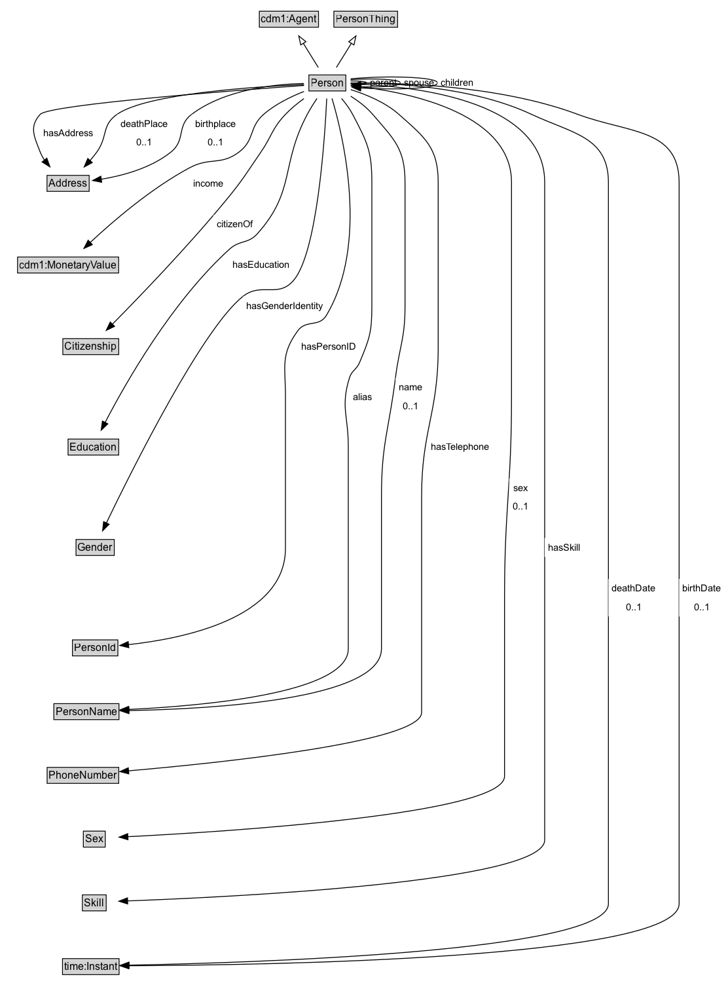

# Person

A Person is an individual human being.

NOTE: Some properties are not defined in the Person ontology, but in an extension of the Person ontology that captures the interaction between iCity domain ontologies (e.g. Persons and their Vehicles)

## Diagram

=== "SVG (interactive)"

    <!-- Generated by graphviz version 14.1.3 (20260303.0454)
     -->
    <!-- Pages: 1 -->
    <svg width="834pt" height="1145pt"
     viewBox="0.00 0.00 834.00 1145.00" xmlns="http://www.w3.org/2000/svg" xmlns:xlink="http://www.w3.org/1999/xlink">
    <g id="graph0" class="graph" transform="scale(1 1) rotate(0) translate(4 1141)">
    <polygon fill="white" stroke="none" points="-4,4 -4,-1141 830.25,-1141 830.25,4 -4,4"/>
    <g id="clust3" class="cluster">
    <title>cluster_associated</title>
    </g>
    <!-- cdm1_Agent -->
    <g id="node1" class="node">
    <title>cdm1_Agent</title>
    <g id="a_node1"><a xlink:href="https://w3id.org/citydata/part1/v1/Agent" xlink:title="&lt;TABLE&gt;">
    <polygon fill="lightgray" stroke="none" points="294.12,-1110.88 294.12,-1127.12 359.88,-1127.12 359.88,-1110.88 294.12,-1110.88"/>
    <text xml:space="preserve" text-anchor="start" x="295.12" y="-1114.88" font-family="Arial" font-size="12.00">cdm1:Agent</text>
    <polygon fill="none" stroke="black" points="293.12,-1109.88 293.12,-1128.12 360.88,-1128.12 360.88,-1109.88 293.12,-1109.88"/>
    </a>
    </g>
    </g>
    <!-- PersonThing -->
    <g id="node2" class="node">
    <title>PersonThing</title>
    <g id="a_node2"><a xlink:href="../PersonThing" xlink:title="&lt;TABLE&gt;">
    <polygon fill="lightgray" stroke="none" points="379.5,-1110.88 379.5,-1127.12 450.5,-1127.12 450.5,-1110.88 379.5,-1110.88"/>
    <text xml:space="preserve" text-anchor="start" x="380.5" y="-1114.88" font-family="Arial" font-size="12.00">PersonThing</text>
    <polygon fill="none" stroke="black" points="378.5,-1109.88 378.5,-1128.12 451.5,-1128.12 451.5,-1109.88 378.5,-1109.88"/>
    </a>
    </g>
    </g>
    <!-- Person -->
    <g id="node3" class="node">
    <title>Person</title>
    <g id="a_node3"><a xlink:href="../Person" xlink:title="&lt;TABLE&gt;">
    <polygon fill="lightgray" stroke="none" points="350.88,-1037.88 350.88,-1054.12 391.12,-1054.12 391.12,-1037.88 350.88,-1037.88"/>
    <text xml:space="preserve" text-anchor="start" x="351.88" y="-1041.88" font-family="Arial" font-size="12.00">Person</text>
    <polygon fill="none" stroke="black" points="349.88,-1036.88 349.88,-1055.12 392.12,-1055.12 392.12,-1036.88 349.88,-1036.88"/>
    </a>
    </g>
    </g>
    <!-- Person&#45;&gt;cdm1_Agent -->
    <g id="edge1" class="edge">
    <title>Person&#45;&gt;cdm1_Agent</title>
    <path fill="none" stroke="black" d="M360.65,-1063.71C355.51,-1072 349.18,-1082.21 343.4,-1091.54"/>
    <polygon fill="none" stroke="black" points="340.52,-1089.54 338.22,-1099.89 346.47,-1093.23 340.52,-1089.54"/>
    </g>
    <!-- Person&#45;&gt;PersonThing -->
    <g id="edge2" class="edge">
    <title>Person&#45;&gt;PersonThing</title>
    <path fill="none" stroke="black" d="M381.35,-1063.71C386.49,-1072 392.82,-1082.21 398.6,-1091.54"/>
    <polygon fill="none" stroke="black" points="395.53,-1093.23 403.78,-1099.89 401.48,-1089.54 395.53,-1093.23"/>
    </g>
    <!-- Person&#45;&gt;Person -->
    <g id="edge28" class="edge">
    <title>Person&#45;&gt;Person</title>
    <path fill="none" stroke="black" d="M397.79,-1048.28C407.78,-1048.35 416,-1047.59 416,-1046 416,-1045.08 413.25,-1044.44 409.01,-1044.07"/>
    <polygon fill="black" stroke="black" points="409.41,-1040.59 399.31,-1043.77 409.19,-1047.58 409.41,-1040.59"/>
    <polygon fill="white" stroke="none" points="416,-1035.25 416,-1056.75 454.75,-1056.75 454.75,-1035.25 416,-1035.25"/>
    <text xml:space="preserve" text-anchor="start" x="420" y="-1042.25" font-family="Arial" font-size="11.00">parent</text>
    </g>
    <!-- Person&#45;&gt;Person -->
    <g id="edge30" class="edge">
    <title>Person&#45;&gt;Person</title>
    <path fill="none" stroke="black" d="M397.58,-1049.78C423.38,-1051.56 454.75,-1050.3 454.75,-1046 454.75,-1042.32 431.79,-1040.87 409,-1041.64"/>
    <polygon fill="black" stroke="black" points="408.9,-1038.14 399.09,-1042.14 409.26,-1045.13 408.9,-1038.14"/>
    <polygon fill="white" stroke="none" points="454.75,-1035.25 454.75,-1056.75 497.25,-1056.75 497.25,-1035.25 454.75,-1035.25"/>
    <text xml:space="preserve" text-anchor="start" x="458.75" y="-1042.25" font-family="Arial" font-size="11.00">spouse</text>
    </g>
    <!-- Person&#45;&gt;Person -->
    <g id="edge32" class="edge">
    <title>Person&#45;&gt;Person</title>
    <path fill="none" stroke="black" d="M397.89,-1050.74C437.28,-1054.67 497.25,-1053.09 497.25,-1046 497.25,-1039.54 447.57,-1037.66 408.94,-1040.33"/>
    <polygon fill="black" stroke="black" points="409.07,-1036.81 399.4,-1041.14 409.65,-1043.79 409.07,-1036.81"/>
    <polygon fill="white" stroke="none" points="497.25,-1035.25 497.25,-1056.75 542.75,-1056.75 542.75,-1035.25 497.25,-1035.25"/>
    <text xml:space="preserve" text-anchor="start" x="501.25" y="-1042.25" font-family="Arial" font-size="11.00">children</text>
    </g>
    <!-- Invis -->
    <!-- Person&#45;&gt;Invis -->
    <!-- Address -->
    <g id="node5" class="node">
    <title>Address</title>
    <g id="a_node5"><a xlink:href="../Address" xlink:title="&lt;TABLE&gt;">
    <polygon fill="lightgray" stroke="none" points="50.88,-922.88 50.88,-939.12 97.12,-939.12 97.12,-922.88 50.88,-922.88"/>
    <text xml:space="preserve" text-anchor="start" x="51.88" y="-926.88" font-family="Arial" font-size="12.00">Address</text>
    <polygon fill="none" stroke="black" points="49.88,-921.88 49.88,-940.12 98.12,-940.12 98.12,-921.88 49.88,-921.88"/>
    </a>
    </g>
    </g>
    <!-- Person&#45;&gt;Address -->
    <g id="edge16" class="edge">
    <title>Person&#45;&gt;Address</title>
    <path fill="none" stroke="black" d="M344.2,-1043.12C267.52,-1037.62 52.09,-1021.22 42,-1010 29.22,-995.79 35.08,-984.82 42,-967 43.27,-963.73 45,-960.58 47.01,-957.59"/>
    <polygon fill="black" stroke="black" points="49.66,-959.88 53.19,-949.89 44.2,-955.51 49.66,-959.88"/>
    <polygon fill="white" stroke="none" points="42,-977.75 42,-999.25 107,-999.25 107,-977.75 42,-977.75"/>
    <text xml:space="preserve" text-anchor="start" x="46" y="-984.75" font-family="Arial" font-size="11.00">hasAddress</text>
    </g>
    <!-- Person&#45;&gt;Address -->
    <g id="edge25" class="edge">
    <title>Person&#45;&gt;Address</title>
    <path fill="none" stroke="black" d="M344.35,-1044.11C289.06,-1041.79 164.17,-1033.98 130,-1010 112.26,-997.55 119.66,-984.59 107,-967 104.56,-963.61 101.82,-960.22 98.99,-956.94"/>
    <polygon fill="black" stroke="black" points="101.76,-954.79 92.43,-949.77 96.6,-959.51 101.76,-954.79"/>
    <polygon fill="white" stroke="none" points="130,-967 130,-1010 192,-1010 192,-967 130,-967"/>
    <text xml:space="preserve" text-anchor="start" x="134" y="-995.5" font-family="Arial" font-size="11.00">deathPlace</text>
    <text xml:space="preserve" text-anchor="start" x="152" y="-974" font-family="Arial" font-size="11.00">0..1</text>
    </g>
    <!-- Person&#45;&gt;Address -->
    <g id="edge29" class="edge">
    <title>Person&#45;&gt;Address</title>
    <path fill="none" stroke="black" d="M344.04,-1045.42C310.64,-1044.6 253.5,-1038.65 215.5,-1010 198.11,-996.89 208.94,-980.69 192,-967 169.18,-948.57 136.91,-939.84 111.88,-935.71"/>
    <polygon fill="black" stroke="black" points="112.5,-932.26 102.1,-934.29 111.49,-939.19 112.5,-932.26"/>
    <polygon fill="white" stroke="none" points="215.5,-967 215.5,-1010 270,-1010 270,-967 215.5,-967"/>
    <text xml:space="preserve" text-anchor="start" x="219.5" y="-995.5" font-family="Arial" font-size="11.00">birthplace</text>
    <text xml:space="preserve" text-anchor="start" x="233.75" y="-974" font-family="Arial" font-size="11.00">0..1</text>
    </g>
    <!-- cdm1_MonetaryValue -->
    <g id="node6" class="node">
    <title>cdm1_MonetaryValue</title>
    <g id="a_node6"><a xlink:href="https://w3id.org/citydata/part1/v1/MonetaryValue" xlink:title="&lt;TABLE&gt;">
    <polygon fill="lightgray" stroke="none" points="17.12,-829.38 17.12,-845.62 130.88,-845.62 130.88,-829.38 17.12,-829.38"/>
    <text xml:space="preserve" text-anchor="start" x="18.12" y="-833.38" font-family="Arial" font-size="12.00">cdm1:MonetaryValue</text>
    <polygon fill="none" stroke="black" points="16.12,-828.38 16.12,-846.62 131.88,-846.62 131.88,-828.38 16.12,-828.38"/>
    </a>
    </g>
    </g>
    <!-- Person&#45;&gt;cdm1_MonetaryValue -->
    <g id="edge22" class="edge">
    <title>Person&#45;&gt;cdm1_MonetaryValue</title>
    <path fill="none" stroke="black" d="M344.29,-1036.26C329.49,-1030.48 311.42,-1021.77 298,-1010 280.86,-994.96 288.14,-980.82 270,-967 249.04,-951.03 236.76,-961.38 213.5,-949 169.64,-925.65 125.83,-888.03 99.32,-863.28"/>
    <polygon fill="black" stroke="black" points="101.79,-860.8 92.12,-856.46 96.97,-865.88 101.79,-860.8"/>
    <polygon fill="white" stroke="none" points="213.5,-920.25 213.5,-941.75 256,-941.75 256,-920.25 213.5,-920.25"/>
    <text xml:space="preserve" text-anchor="start" x="217.5" y="-927.25" font-family="Arial" font-size="11.00">income</text>
    </g>
    <!-- Citizenship -->
    <g id="node7" class="node">
    <title>Citizenship</title>
    <g id="a_node7"><a xlink:href="../Citizenship" xlink:title="&lt;TABLE&gt;">
    <polygon fill="lightgray" stroke="none" points="69,-735.88 69,-752.12 131,-752.12 131,-735.88 69,-735.88"/>
    <text xml:space="preserve" text-anchor="start" x="70" y="-739.88" font-family="Arial" font-size="12.00">Citizenship</text>
    <polygon fill="none" stroke="black" points="68,-734.88 68,-753.12 132,-753.12 132,-734.88 68,-734.88"/>
    </a>
    </g>
    </g>
    <!-- Person&#45;&gt;Citizenship -->
    <g id="edge31" class="edge">
    <title>Person&#45;&gt;Citizenship</title>
    <path fill="none" stroke="black" d="M344.19,-1028.07C336.87,-1022.78 329.25,-1016.58 323,-1010 307.31,-993.45 307.9,-985.81 295,-967 278.25,-942.59 274.77,-935.89 256,-913 212.21,-859.61 156.12,-801.42 124.52,-769.46"/>
    <polygon fill="black" stroke="black" points="127.26,-767.25 117.73,-762.62 122.29,-772.18 127.26,-767.25"/>
    <polygon fill="white" stroke="none" points="240.67,-873.5 240.67,-895 289.92,-895 289.92,-873.5 240.67,-873.5"/>
    <text xml:space="preserve" text-anchor="start" x="244.67" y="-880.5" font-family="Arial" font-size="11.00">citizenOf</text>
    </g>
    <!-- Education -->
    <g id="node8" class="node">
    <title>Education</title>
    <g id="a_node8"><a xlink:href="../Education" xlink:title="&lt;TABLE&gt;">
    <polygon fill="lightgray" stroke="none" points="75,-620.88 75,-637.12 131,-637.12 131,-620.88 75,-620.88"/>
    <text xml:space="preserve" text-anchor="start" x="76" y="-624.88" font-family="Arial" font-size="12.00">Education</text>
    <polygon fill="none" stroke="black" points="74,-619.88 74,-638.12 132,-638.12 132,-619.88 74,-619.88"/>
    </a>
    </g>
    </g>
    <!-- Person&#45;&gt;Education -->
    <g id="edge23" class="edge">
    <title>Person&#45;&gt;Education</title>
    <path fill="none" stroke="black" d="M359.12,-1028.3C355.33,-1022.63 351.28,-1016.16 348,-1010 317.15,-951.95 334.78,-922.55 291,-873.5 280.07,-861.25 270.9,-866.54 258.75,-855.5 192.74,-795.51 139.89,-702.45 116.32,-656.93"/>
    <polygon fill="black" stroke="black" points="119.57,-655.6 111.91,-648.29 113.34,-658.79 119.57,-655.6"/>
    <polygon fill="white" stroke="none" points="258.75,-826.75 258.75,-848.25 332,-848.25 332,-826.75 258.75,-826.75"/>
    <text xml:space="preserve" text-anchor="start" x="262.75" y="-833.75" font-family="Arial" font-size="11.00">hasEducation</text>
    </g>
    <!-- Gender -->
    <g id="node9" class="node">
    <title>Gender</title>
    <g id="a_node9"><a xlink:href="../Gender" xlink:title="&lt;TABLE&gt;">
    <polygon fill="lightgray" stroke="none" points="84.12,-505.88 84.12,-522.12 125.88,-522.12 125.88,-505.88 84.12,-505.88"/>
    <text xml:space="preserve" text-anchor="start" x="85.12" y="-509.88" font-family="Arial" font-size="12.00">Gender</text>
    <polygon fill="none" stroke="black" points="83.12,-504.88 83.12,-523.12 126.88,-523.12 126.88,-504.88 83.12,-504.88"/>
    </a>
    </g>
    </g>
    <!-- Person&#45;&gt;Gender -->
    <g id="edge21" class="edge">
    <title>Person&#45;&gt;Gender</title>
    <path fill="none" stroke="black" d="M370.31,-1028.14C368.05,-981.26 359.38,-850.72 332,-819.5 314.27,-799.29 295.33,-818.19 274.25,-801.5 228.22,-765.06 148.6,-605.9 117.74,-541.85"/>
    <polygon fill="black" stroke="black" points="121.02,-540.6 113.54,-533.09 114.71,-543.62 121.02,-540.6"/>
    <polygon fill="white" stroke="none" points="274.25,-780 274.25,-801.5 370,-801.5 370,-780 274.25,-780"/>
    <text xml:space="preserve" text-anchor="start" x="278.25" y="-787" font-family="Arial" font-size="11.00">hasGenderIdentity</text>
    </g>
    <!-- PersonId -->
    <g id="node10" class="node">
    <title>PersonId</title>
    <g id="a_node10"><a xlink:href="../PersonId" xlink:title="&lt;TABLE&gt;">
    <polygon fill="lightgray" stroke="none" points="80,-390.88 80,-407.12 130,-407.12 130,-390.88 80,-390.88"/>
    <text xml:space="preserve" text-anchor="start" x="81" y="-394.88" font-family="Arial" font-size="12.00">PersonId</text>
    <polygon fill="none" stroke="black" points="79,-389.88 79,-408.12 131,-408.12 131,-389.88 79,-389.88"/>
    </a>
    </g>
    </g>
    <!-- Person&#45;&gt;PersonId -->
    <g id="edge26" class="edge">
    <title>Person&#45;&gt;PersonId</title>
    <path fill="none" stroke="black" d="M376.36,-1028.26C389.46,-983.98 418.65,-861.6 370,-780 361.44,-765.65 346.82,-775.51 337,-762 317.19,-734.75 323,-721.19 323,-687.5 323,-687.5 323,-687.5 323,-513 323,-432.9 205.57,-409.51 143.08,-402.73"/>
    <polygon fill="black" stroke="black" points="143.53,-399.26 133.24,-401.76 142.85,-406.22 143.53,-399.26"/>
    <polygon fill="white" stroke="none" points="337,-733.25 337,-754.75 408,-754.75 408,-733.25 337,-733.25"/>
    <text xml:space="preserve" text-anchor="start" x="341" y="-740.25" font-family="Arial" font-size="11.00">hasPersonID</text>
    </g>
    <!-- PersonName -->
    <g id="node11" class="node">
    <title>PersonName</title>
    <g id="a_node11"><a xlink:href="../PersonName" xlink:title="&lt;TABLE&gt;">
    <polygon fill="lightgray" stroke="none" points="58.75,-317.88 58.75,-334.12 131.25,-334.12 131.25,-317.88 58.75,-317.88"/>
    <text xml:space="preserve" text-anchor="start" x="59.75" y="-321.88" font-family="Arial" font-size="12.00">PersonName</text>
    <polygon fill="none" stroke="black" points="57.75,-316.88 57.75,-335.12 132.25,-335.12 132.25,-316.88 57.75,-316.88"/>
    </a>
    </g>
    </g>
    <!-- Person&#45;&gt;PersonName -->
    <g id="edge15" class="edge">
    <title>Person&#45;&gt;PersonName</title>
    <path fill="none" stroke="black" d="M387.3,-1028.23C391.93,-1022.76 396.63,-1016.43 400,-1010 416.74,-978.11 422,-968.02 422,-932 422,-932 422,-932 422,-789.75 422,-760.74 419.22,-752.75 408,-726 404.3,-717.19 399.05,-717.13 396.25,-708 386.1,-674.85 395,-664.67 395,-630 395,-630 395,-630 395,-398 395,-346.95 228.39,-332.55 143.5,-328.54"/>
    <polygon fill="black" stroke="black" points="143.74,-325.04 133.6,-328.1 143.44,-332.04 143.74,-325.04"/>
    <polygon fill="white" stroke="none" points="396.25,-675.75 396.25,-697.25 426,-697.25 426,-675.75 396.25,-675.75"/>
    <text xml:space="preserve" text-anchor="start" x="400.25" y="-682.75" font-family="Arial" font-size="11.00">alias</text>
    </g>
    <!-- Person&#45;&gt;PersonName -->
    <g id="edge19" class="edge">
    <title>Person&#45;&gt;PersonName</title>
    <path fill="none" stroke="black" d="M397.76,-1030.87C406.6,-1025.25 415.97,-1018.17 423,-1010 448.03,-980.92 460,-970.37 460,-932 460,-932 460,-932 460,-789.75 460,-753.09 453.59,-744.37 449,-708 441.4,-647.84 433,-633.14 433,-572.5 433,-572.5 433,-572.5 433,-398 433,-339.56 237.06,-328.95 143.55,-327.22"/>
    <polygon fill="black" stroke="black" points="143.71,-323.72 133.65,-327.06 143.6,-330.72 143.71,-323.72"/>
    <polygon fill="white" stroke="none" points="449,-665 449,-708 484,-708 484,-665 449,-665"/>
    <text xml:space="preserve" text-anchor="start" x="453" y="-693.5" font-family="Arial" font-size="11.00">name</text>
    <text xml:space="preserve" text-anchor="start" x="457.5" y="-672" font-family="Arial" font-size="11.00">0..1</text>
    </g>
    <!-- PhoneNumber -->
    <g id="node12" class="node">
    <title>PhoneNumber</title>
    <g id="a_node12"><a xlink:href="../PhoneNumber" xlink:title="&lt;TABLE&gt;">
    <polygon fill="lightgray" stroke="none" points="51,-244.88 51,-261.12 131,-261.12 131,-244.88 51,-244.88"/>
    <text xml:space="preserve" text-anchor="start" x="52" y="-248.88" font-family="Arial" font-size="12.00">PhoneNumber</text>
    <polygon fill="none" stroke="black" points="50,-243.88 50,-262.12 132,-262.12 132,-243.88 50,-243.88"/>
    </a>
    </g>
    </g>
    <!-- Person&#45;&gt;PhoneNumber -->
    <g id="edge18" class="edge">
    <title>Person&#45;&gt;PhoneNumber</title>
    <path fill="none" stroke="black" d="M397.78,-1038.35C415.09,-1032.97 437.25,-1023.97 453,-1010 482.94,-983.45 498,-972.02 498,-932 498,-932 498,-932 498,-743 498,-666.75 479,-648.75 479,-572.5 479,-572.5 479,-572.5 479,-325 479,-291.25 248.98,-267.38 143.15,-258.19"/>
    <polygon fill="black" stroke="black" points="143.56,-254.71 133.3,-257.34 142.96,-261.68 143.56,-254.71"/>
    <polygon fill="white" stroke="none" points="486.08,-618.25 486.08,-639.75 560.83,-639.75 560.83,-618.25 486.08,-618.25"/>
    <text xml:space="preserve" text-anchor="start" x="490.08" y="-625.25" font-family="Arial" font-size="11.00">hasTelephone</text>
    </g>
    <!-- Sex -->
    <g id="node13" class="node">
    <title>Sex</title>
    <g id="a_node13"><a xlink:href="../Sex" xlink:title="&lt;TABLE&gt;">
    <polygon fill="lightgray" stroke="none" points="92.5,-171.88 92.5,-188.12 115.5,-188.12 115.5,-171.88 92.5,-171.88"/>
    <text xml:space="preserve" text-anchor="start" x="93.5" y="-175.88" font-family="Arial" font-size="12.00">Sex</text>
    <polygon fill="none" stroke="black" points="91.5,-170.88 91.5,-189.12 116.5,-189.12 116.5,-170.88 91.5,-170.88"/>
    </a>
    </g>
    </g>
    <!-- Person&#45;&gt;Sex -->
    <g id="edge24" class="edge">
    <title>Person&#45;&gt;Sex</title>
    <path fill="none" stroke="black" d="M397.72,-1042.99C454.5,-1037.11 582,-1014.69 582,-932 582,-932 582,-932 582,-685.5 582,-584.1 574,-558.9 574,-457.5 574,-457.5 574,-457.5 574,-252 574,-208.46 254.53,-188.45 142.37,-182.77"/>
    <polygon fill="black" stroke="black" points="142.63,-179.28 132.47,-182.28 142.28,-186.27 142.63,-179.28"/>
    <polygon fill="white" stroke="none" points="579.31,-550 579.31,-593 605.31,-593 605.31,-550 579.31,-550"/>
    <text xml:space="preserve" text-anchor="start" x="584.06" y="-578.5" font-family="Arial" font-size="11.00">sex</text>
    <text xml:space="preserve" text-anchor="start" x="583.31" y="-557" font-family="Arial" font-size="11.00">0..1</text>
    </g>
    <!-- Skill -->
    <g id="node14" class="node">
    <title>Skill</title>
    <g id="a_node14"><a xlink:href="../Skill" xlink:title="&lt;TABLE&gt;">
    <polygon fill="lightgray" stroke="none" points="91.38,-98.88 91.38,-115.12 116.62,-115.12 116.62,-98.88 91.38,-98.88"/>
    <text xml:space="preserve" text-anchor="start" x="92.38" y="-102.88" font-family="Arial" font-size="12.00">Skill</text>
    <polygon fill="none" stroke="black" points="90.38,-97.88 90.38,-116.12 117.62,-116.12 117.62,-97.88 90.38,-97.88"/>
    </a>
    </g>
    </g>
    <!-- Person&#45;&gt;Skill -->
    <g id="edge17" class="edge">
    <title>Person&#45;&gt;Skill</title>
    <path fill="none" stroke="black" d="M397.65,-1044.89C461.88,-1043.1 620,-1028.84 620,-932 620,-932 620,-932 620,-179 620,-130.75 261.37,-113.6 142.08,-109.23"/>
    <polygon fill="black" stroke="black" points="142.29,-105.74 132.17,-108.88 142.04,-112.74 142.29,-105.74"/>
    <polygon fill="white" stroke="none" points="620,-503.25 620,-524.75 664.75,-524.75 664.75,-503.25 620,-503.25"/>
    <text xml:space="preserve" text-anchor="start" x="624" y="-510.25" font-family="Arial" font-size="11.00">hasSkill</text>
    </g>
    <!-- time_Instant -->
    <g id="node15" class="node">
    <title>time_Instant</title>
    <g id="a_node15"><a xlink:href="https://w3id.org/citydata/imported/time/latest/Instant" xlink:title="&lt;TABLE&gt;">
    <polygon fill="lightgray" stroke="none" points="68.62,-25.88 68.62,-42.12 131.38,-42.12 131.38,-25.88 68.62,-25.88"/>
    <text xml:space="preserve" text-anchor="start" x="69.62" y="-29.88" font-family="Arial" font-size="12.00">time:Instant</text>
    <polygon fill="none" stroke="black" points="67.62,-24.88 67.62,-43.12 132.38,-43.12 132.38,-24.88 67.62,-24.88"/>
    </a>
    </g>
    </g>
    <!-- Person&#45;&gt;time_Instant -->
    <g id="edge20" class="edge">
    <title>Person&#45;&gt;time_Instant</title>
    <path fill="none" stroke="black" d="M397.67,-1045.83C442.62,-1046.19 535.4,-1042.5 605,-1010 652.36,-987.89 693,-984.26 693,-932 693,-932 693,-932 693,-106 693,-50.65 280.45,-38.24 143.55,-35.64"/>
    <polygon fill="black" stroke="black" points="143.88,-32.15 133.82,-35.47 143.75,-39.15 143.88,-32.15"/>
    <polygon fill="white" stroke="none" points="693,-435 693,-478 751.25,-478 751.25,-435 693,-435"/>
    <text xml:space="preserve" text-anchor="start" x="697" y="-463.5" font-family="Arial" font-size="11.00">deathDate</text>
    <text xml:space="preserve" text-anchor="start" x="713.12" y="-442" font-family="Arial" font-size="11.00">0..1</text>
    </g>
    <!-- Person&#45;&gt;time_Instant -->
    <g id="edge27" class="edge">
    <title>Person&#45;&gt;time_Instant</title>
    <path fill="none" stroke="black" d="M397.69,-1045.82C449.59,-1046.55 566.98,-1043.91 658,-1010 716.22,-988.31 774,-994.13 774,-932 774,-932 774,-932 774,-106 774,-42.35 292.44,-35.57 143.41,-35"/>
    <polygon fill="black" stroke="black" points="143.58,-31.5 133.57,-34.97 143.56,-38.5 143.58,-31.5"/>
    <polygon fill="white" stroke="none" points="774,-435 774,-478 826.25,-478 826.25,-435 774,-435"/>
    <text xml:space="preserve" text-anchor="start" x="778" y="-463.5" font-family="Arial" font-size="11.00">birthDate</text>
    <text xml:space="preserve" text-anchor="start" x="791.12" y="-442" font-family="Arial" font-size="11.00">0..1</text>
    </g>
    <!-- Invis&#45;&gt;Address -->
    <!-- Address&#45;&gt;cdm1_MonetaryValue -->
    <!-- cdm1_MonetaryValue&#45;&gt;Citizenship -->
    <!-- Citizenship&#45;&gt;Education -->
    <!-- Education&#45;&gt;Gender -->
    <!-- Gender&#45;&gt;PersonId -->
    <!-- PersonId&#45;&gt;PersonName -->
    <!-- PersonName&#45;&gt;PhoneNumber -->
    <!-- PhoneNumber&#45;&gt;Sex -->
    <!-- Sex&#45;&gt;Skill -->
    <!-- Skill&#45;&gt;time_Instant -->
    </g>
    </svg>

=== "PNG"

    

## Specializations of Person

| Class | Description |
|-------|-------------|
| [City Resident](CityResident.md) | A City Resident is a Person who satisfies the requirements of being a city resident for the particular City. |

## Formalization for Person

| Property | Constraint |
|----------|------------|
| [alias](../properties/alias.md) | only [PersonName](https://w3id.org/citydata/part2/v1/PersonName) |
| [birthDate](../properties/birthDate.md) | max 1 |
| [birthDate](../properties/birthDate.md) | max 1 [time:Instant](http://www.w3.org/2006/time#Instant) |
| [birthplace](../properties/birthplace.md) | max 1 |
| [birthplace](../properties/birthplace.md) | max 1 [Address](https://w3id.org/citydata/part2/v1/Address) |
| [children](../properties/children.md) | only [Person](https://w3id.org/citydata/part2/v1/Person) |
| [citizenOf](../properties/citizenOf.md) | only [Citizenship](https://w3id.org/citydata/part2/v1/Citizenship) |
| [deathDate](../properties/deathDate.md) | max 1 |
| [deathDate](../properties/deathDate.md) | max 1 [time:Instant](http://www.w3.org/2006/time#Instant) |
| [deathPlace](../properties/deathPlace.md) | max 1 |
| [deathPlace](../properties/deathPlace.md) | max 1 [Address](https://w3id.org/citydata/part2/v1/Address) |
| [hasAddress](../properties/hasAddress.md) | only [Address](https://w3id.org/citydata/part2/v1/Address) |
| [hasEducation](../properties/hasEducation.md) | only [Education](https://w3id.org/citydata/part2/v1/Education) |
| [hasEmail](../properties/hasEmail.md) | only [EmailAddress](https://w3id.org/citydata/part2/v1/EmailAddress) |
| [hasGenderIdentity](../properties/hasGenderIdentity.md) | only [Gender](https://w3id.org/citydata/part2/v1/Gender) |
| [hasPersonID](../properties/hasPersonID.md) | only [PersonId](https://w3id.org/citydata/part2/v1/PersonId) |
| [hasSkill](../properties/hasSkill.md) | only [Skill](https://w3id.org/citydata/part2/v1/Skill) |
| [hasTelephone](../properties/hasTelephone.md) | only [PhoneNumber](https://w3id.org/citydata/part2/v1/PhoneNumber) |
| [income](../properties/income.md) | only [cdm1:MonetaryValue](https://w3id.org/citydata/part1/v1/MonetaryValue) |
| [name](../properties/name.md) | max 1 |
| [name](../properties/name.md) | max 1 [PersonName](https://w3id.org/citydata/part2/v1/PersonName) |
| [parent](../properties/parent.md) | only [Person](https://w3id.org/citydata/part2/v1/Person) |
| [sex](../properties/sex.md) | max 1 |
| [sex](../properties/sex.md) | max 1 [Sex](https://w3id.org/citydata/part2/v1/Sex) |
| [spouse](../properties/spouse.md) | only [Person](https://w3id.org/citydata/part2/v1/Person) |
| subClassOf | [cdm1:Agent](https://w3id.org/citydata/part1/v1/Agent) |
| subClassOf | [PersonThing](PersonThing.md) |

