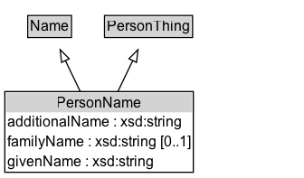

# PersonName

## Diagram

=== "SVG (interactive)"

    <!-- Generated by graphviz version 14.1.3 (20260303.0454)
     -->
    <!-- Pages: 1 -->
    <svg width="252pt" height="148pt"
     viewBox="0.00 0.00 252.00 148.00" xmlns="http://www.w3.org/2000/svg" xmlns:xlink="http://www.w3.org/1999/xlink">
    <g id="graph0" class="graph" transform="scale(1 1) rotate(0) translate(4 143.5)">
    <polygon fill="white" stroke="none" points="-4,4 -4,-143.5 248.12,-143.5 248.12,4 -4,4"/>
    <g id="clust3" class="cluster">
    <title>cluster_associated</title>
    </g>
    <!-- Name -->
    <g id="node1" class="node">
    <title>Name</title>
    <g id="a_node1"><a xlink:href="../Name" xlink:title="&lt;TABLE&gt;">
    <polygon fill="lightgray" stroke="none" points="20,-113.38 20,-129.62 54.25,-129.62 54.25,-113.38 20,-113.38"/>
    <text xml:space="preserve" text-anchor="start" x="21" y="-117.38" font-family="Arial" font-size="12.00">Name</text>
    <polygon fill="none" stroke="black" points="19,-112.38 19,-130.62 55.25,-130.62 55.25,-112.38 19,-112.38"/>
    </a>
    </g>
    </g>
    <!-- PersonThing -->
    <g id="node2" class="node">
    <title>PersonThing</title>
    <g id="a_node2"><a xlink:href="../PersonThing" xlink:title="&lt;TABLE&gt;">
    <polygon fill="lightgray" stroke="none" points="83.62,-113.38 83.62,-129.62 154.62,-129.62 154.62,-113.38 83.62,-113.38"/>
    <text xml:space="preserve" text-anchor="start" x="84.62" y="-117.38" font-family="Arial" font-size="12.00">PersonThing</text>
    <polygon fill="none" stroke="black" points="82.62,-112.38 82.62,-130.62 155.62,-130.62 155.62,-112.38 82.62,-112.38"/>
    </a>
    </g>
    </g>
    <!-- PersonName -->
    <g id="node3" class="node">
    <title>PersonName</title>
    <g id="a_node3"><a xlink:href="../PersonName" xlink:title="&lt;TABLE&gt;">
    <polygon fill="lightgray" stroke="none" points="1,-50.25 1,-66.5 155.25,-66.5 155.25,-50.25 1,-50.25"/>
    <text xml:space="preserve" text-anchor="start" x="42.88" y="-54.25" font-family="Arial" font-size="12.00">PersonName</text>
    <text xml:space="preserve" text-anchor="start" x="2" y="-38" font-family="Arial" font-size="12.00">additionalName : xsd:string</text>
    <text xml:space="preserve" text-anchor="start" x="2" y="-21.75" font-family="Arial" font-size="12.00">familyName : xsd:string [0..1]</text>
    <text xml:space="preserve" text-anchor="start" x="2" y="-5.5" font-family="Arial" font-size="12.00">givenName : xsd:string</text>
    <polygon fill="none" stroke="black" points="0,-0.5 0,-67.5 156.25,-67.5 156.25,-0.5 0,-0.5"/>
    </a>
    </g>
    </g>
    <!-- PersonName&#45;&gt;Name -->
    <g id="edge1" class="edge">
    <title>PersonName&#45;&gt;Name</title>
    <path fill="none" stroke="black" d="M62.57,-67.43C58.46,-76 54.07,-85.16 50.12,-93.41"/>
    <polygon fill="none" stroke="black" points="47.05,-91.71 45.88,-102.24 53.36,-94.74 47.05,-91.71"/>
    </g>
    <!-- PersonName&#45;&gt;PersonThing -->
    <g id="edge2" class="edge">
    <title>PersonName&#45;&gt;PersonThing</title>
    <path fill="none" stroke="black" d="M93.68,-67.43C97.79,-76 102.18,-85.16 106.13,-93.41"/>
    <polygon fill="none" stroke="black" points="102.89,-94.74 110.37,-102.24 109.2,-91.71 102.89,-94.74"/>
    </g>
    <!-- Invis -->
    </g>
    </svg>

=== "PNG"

    

## Formalization for PersonName

| Property | Constraint |
|----------|------------|
| [additionalName](../properties/additionalName.md) | datatype xsd:string |
| [familyName](../properties/familyName.md) | max 1 |
| [familyName](../properties/familyName.md) | max 1 xsd:string |
| [givenName](../properties/givenName.md) | datatype xsd:string |
| subClassOf | [Name](Name.md) |
| subClassOf | [PersonThing](PersonThing.md) |

