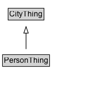

# PersonThing

Added for organizational purposes, to identify classes defined in the Person ontology.

## Diagram

=== "SVG (interactive)"

    <!-- Generated by graphviz version 14.1.3 (20260303.0454)
     -->
    <!-- Pages: 1 -->
    <svg width="170pt" height="132pt"
     viewBox="0.00 0.00 170.00 132.00" xmlns="http://www.w3.org/2000/svg" xmlns:xlink="http://www.w3.org/1999/xlink">
    <g id="graph0" class="graph" transform="scale(1 1) rotate(0) translate(4 128)">
    <polygon fill="white" stroke="none" points="-4,4 -4,-128 165.5,-128 165.5,4 -4,4"/>
    <g id="clust3" class="cluster">
    <title>cluster_associated</title>
    </g>
    <!-- CityThing -->
    <g id="node1" class="node">
    <title>CityThing</title>
    <g id="a_node1"><a xlink:href="../CityThing" xlink:title="&lt;TABLE&gt;">
    <polygon fill="lightgray" stroke="none" points="9.62,-97.88 9.62,-114.12 63.38,-114.12 63.38,-97.88 9.62,-97.88"/>
    <text xml:space="preserve" text-anchor="start" x="10.62" y="-101.88" font-family="Arial" font-size="12.00">CityThing</text>
    <polygon fill="none" stroke="black" points="8.62,-96.88 8.62,-115.12 64.38,-115.12 64.38,-96.88 8.62,-96.88"/>
    </a>
    </g>
    </g>
    <!-- PersonThing -->
    <g id="node2" class="node">
    <title>PersonThing</title>
    <g id="a_node2"><a xlink:href="../PersonThing" xlink:title="&lt;TABLE&gt;">
    <polygon fill="lightgray" stroke="none" points="1,-25.88 1,-42.12 72,-42.12 72,-25.88 1,-25.88"/>
    <text xml:space="preserve" text-anchor="start" x="2" y="-29.88" font-family="Arial" font-size="12.00">PersonThing</text>
    <polygon fill="none" stroke="black" points="0,-24.88 0,-43.12 73,-43.12 73,-24.88 0,-24.88"/>
    </a>
    </g>
    </g>
    <!-- PersonThing&#45;&gt;CityThing -->
    <g id="edge1" class="edge">
    <title>PersonThing&#45;&gt;CityThing</title>
    <path fill="none" stroke="black" d="M36.5,-51.79C36.5,-59.25 36.5,-68.24 36.5,-76.69"/>
    <polygon fill="none" stroke="black" points="33,-76.54 36.5,-86.54 40,-76.54 33,-76.54"/>
    </g>
    <!-- Invis -->
    </g>
    </svg>

=== "PNG"

    

## Specializations of PersonThing

| Class | Description |
|-------|-------------|
| [Citizenship](Citizenship.md) | Citizenship is a type of City Thing that indicates the country of citizenship for a person during a specific period. |
| [City Resident](CityResident.md) | A City Resident is a Person who satisfies the requirements of being a city resident for the particular City. |
| [Education](Education.md) | Education is a type of Code that describes the educational background of a person. |
| [Gender](Gender.md) | Gender is a type of Code that describes the gender identity of a person. |
| [Id Type](IDType.md) | ID Type is a type of Code that describes the type of identification document issued to a person. |
| [Person](Person.md) | A Person is an individual human being. |
| [Person Id](PersonId.md) | Person ID is a type of City Thing that represents an identification document issued to a person by an authoritative body. |
| [Person Name](PersonName.md) |  |
| [Sex](Sex.md) | Sex is a type of Code that describes the biological sex of a person. |
| [Skill](Skill.md) | Skill is a type of Code that describes a specific ability or competency of a person. |

## Formalization for PersonThing

| Property | Constraint |
|----------|------------|
| subClassOf | [CityThing](CityThing.md) |

