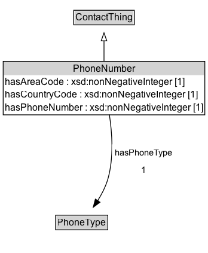

# PhoneNumber

A PhoneNumber defines the complete international phone number and type of number.

## Diagram

=== "SVG (interactive)"

    <!-- Generated by graphviz version 14.1.3 (20260303.0454)
     -->
    <!-- Pages: 1 -->
    <svg width="261pt" height="317pt"
     viewBox="0.00 0.00 261.00 317.00" xmlns="http://www.w3.org/2000/svg" xmlns:xlink="http://www.w3.org/1999/xlink">
    <g id="graph0" class="graph" transform="scale(1 1) rotate(0) translate(4 313)">
    <polygon fill="white" stroke="none" points="-4,4 -4,-313 257,-313 257,4 -4,4"/>
    <g id="clust3" class="cluster">
    <title>cluster_associated</title>
    </g>
    <!-- ContactThing -->
    <g id="node1" class="node">
    <title>ContactThing</title>
    <g id="a_node1"><a xlink:href="../ContactThing" xlink:title="&lt;TABLE&gt;">
    <polygon fill="lightgray" stroke="none" points="89.5,-282.88 89.5,-299.12 163.5,-299.12 163.5,-282.88 89.5,-282.88"/>
    <text xml:space="preserve" text-anchor="start" x="90.5" y="-286.88" font-family="Arial" font-size="12.00">ContactThing</text>
    <polygon fill="none" stroke="black" points="88.5,-281.88 88.5,-300.12 164.5,-300.12 164.5,-281.88 88.5,-281.88"/>
    </a>
    </g>
    </g>
    <!-- PhoneNumber -->
    <g id="node2" class="node">
    <title>PhoneNumber</title>
    <g id="a_node2"><a xlink:href="../PhoneNumber" xlink:title="&lt;TABLE&gt;">
    <polygon fill="lightgray" stroke="none" points="1,-218.75 1,-235 252,-235 252,-218.75 1,-218.75"/>
    <text xml:space="preserve" text-anchor="start" x="87.5" y="-222.75" font-family="Arial" font-size="12.00">PhoneNumber</text>
    <text xml:space="preserve" text-anchor="start" x="2" y="-206.5" font-family="Arial" font-size="12.00">hasAreaCode : xsd:nonNegativeInteger [1]</text>
    <text xml:space="preserve" text-anchor="start" x="2" y="-190.25" font-family="Arial" font-size="12.00">hasCountryCode : xsd:nonNegativeInteger [1]</text>
    <text xml:space="preserve" text-anchor="start" x="2" y="-174" font-family="Arial" font-size="12.00">hasPhoneNumber : xsd:nonNegativeInteger [1]</text>
    <polygon fill="none" stroke="black" points="0,-169 0,-236 253,-236 253,-169 0,-169"/>
    </a>
    </g>
    </g>
    <!-- PhoneNumber&#45;&gt;ContactThing -->
    <g id="edge1" class="edge">
    <title>PhoneNumber&#45;&gt;ContactThing</title>
    <path fill="none" stroke="black" d="M126.5,-235.89C126.5,-244.45 126.5,-253.62 126.5,-261.93"/>
    <polygon fill="none" stroke="black" points="123,-261.81 126.5,-271.81 130,-261.81 123,-261.81"/>
    </g>
    <!-- Invis -->
    <!-- PhoneNumber&#45;&gt;Invis -->
    <!-- PhoneType -->
    <g id="node4" class="node">
    <title>PhoneType</title>
    <g id="a_node4"><a xlink:href="../PhoneType" xlink:title="&lt;TABLE&gt;">
    <polygon fill="lightgray" stroke="none" points="66.75,-25.88 66.75,-42.12 130.25,-42.12 130.25,-25.88 66.75,-25.88"/>
    <text xml:space="preserve" text-anchor="start" x="67.75" y="-29.88" font-family="Arial" font-size="12.00">PhoneType</text>
    <polygon fill="none" stroke="black" points="65.75,-24.88 65.75,-43.12 131.25,-43.12 131.25,-24.88 65.75,-24.88"/>
    </a>
    </g>
    </g>
    <!-- PhoneNumber&#45;&gt;PhoneType -->
    <g id="edge4" class="edge">
    <title>PhoneNumber&#45;&gt;PhoneType</title>
    <path fill="none" stroke="black" d="M133.22,-169.37C136.72,-146.52 138.91,-115.35 131.5,-89 128.79,-79.38 123.84,-69.77 118.58,-61.39"/>
    <polygon fill="black" stroke="black" points="121.48,-59.43 112.99,-53.1 115.68,-63.35 121.48,-59.43"/>
    <polygon fill="white" stroke="none" points="136.45,-89 136.45,-132 216.45,-132 216.45,-89 136.45,-89"/>
    <text xml:space="preserve" text-anchor="start" x="140.45" y="-117.5" font-family="Arial" font-size="11.00">hasPhoneType</text>
    <text xml:space="preserve" text-anchor="start" x="173.45" y="-96" font-family="Arial" font-size="11.00">1</text>
    </g>
    <!-- Invis&#45;&gt;PhoneType -->
    </g>
    </svg>

=== "PNG"

    

## Formalization for PhoneNumber

| Property | Constraint |
|----------|------------|
| [hasAreaCode](../properties/hasAreaCode.md) | exactly 1 |
| [hasAreaCode](../properties/hasAreaCode.md) | exactly 1 xsd:nonNegativeInteger |
| [hasCountryCode](../properties/hasCountryCode.md) | exactly 1 |
| [hasCountryCode](../properties/hasCountryCode.md) | exactly 1 xsd:nonNegativeInteger |
| [hasPhoneNumber](../properties/hasPhoneNumber.md) | exactly 1 |
| [hasPhoneNumber](../properties/hasPhoneNumber.md) | exactly 1 xsd:nonNegativeInteger |
| [hasPhoneType](../properties/hasPhoneType.md) | exactly 1 |
| [hasPhoneType](../properties/hasPhoneType.md) | exactly 1 [PhoneType](https://w3id.org/citydata/part2/v1/PhoneType) |
| subClassOf | [ContactThing](ContactThing.md) |

