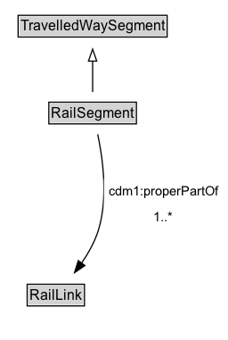

# RailSegment

A Rail Segment is a type of Travelled Way Segment that represents part of a Rail Link.

## Diagram

=== "SVG (interactive)"

    <!-- Generated by graphviz version 14.1.3 (20260303.0454)
     -->
    <!-- Pages: 1 -->
    <svg width="192pt" height="286pt"
     viewBox="0.00 0.00 192.00 286.00" xmlns="http://www.w3.org/2000/svg" xmlns:xlink="http://www.w3.org/1999/xlink">
    <g id="graph0" class="graph" transform="scale(1 1) rotate(0) translate(4 282)">
    <polygon fill="white" stroke="none" points="-4,4 -4,-282 187.75,-282 187.75,4 -4,4"/>
    <g id="clust3" class="cluster">
    <title>cluster_associated</title>
    </g>
    <!-- TravelledWaySegment -->
    <g id="node1" class="node">
    <title>TravelledWaySegment</title>
    <g id="a_node1"><a xlink:href="../TravelledWaySegment" xlink:title="&lt;TABLE&gt;">
    <polygon fill="lightgray" stroke="none" points="12.25,-251.88 12.25,-268.12 135.75,-268.12 135.75,-251.88 12.25,-251.88"/>
    <text xml:space="preserve" text-anchor="start" x="13.25" y="-255.88" font-family="Arial" font-size="12.00">TravelledWaySegment</text>
    <polygon fill="none" stroke="black" points="11.25,-250.88 11.25,-269.12 136.75,-269.12 136.75,-250.88 11.25,-250.88"/>
    </a>
    </g>
    </g>
    <!-- RailSegment -->
    <g id="node2" class="node">
    <title>RailSegment</title>
    <g id="a_node2"><a xlink:href="../RailSegment" xlink:title="&lt;TABLE&gt;">
    <polygon fill="lightgray" stroke="none" points="38.12,-178.88 38.12,-195.12 109.88,-195.12 109.88,-178.88 38.12,-178.88"/>
    <text xml:space="preserve" text-anchor="start" x="39.12" y="-182.88" font-family="Arial" font-size="12.00">RailSegment</text>
    <polygon fill="none" stroke="black" points="37.12,-177.88 37.12,-196.12 110.88,-196.12 110.88,-177.88 37.12,-177.88"/>
    </a>
    </g>
    </g>
    <!-- RailSegment&#45;&gt;TravelledWaySegment -->
    <g id="edge1" class="edge">
    <title>RailSegment&#45;&gt;TravelledWaySegment</title>
    <path fill="none" stroke="black" d="M74,-204.71C74,-212.47 74,-221.92 74,-230.74"/>
    <polygon fill="none" stroke="black" points="70.5,-230.66 74,-240.66 77.5,-230.66 70.5,-230.66"/>
    </g>
    <!-- Invis -->
    <!-- RailSegment&#45;&gt;Invis -->
    <!-- RailLink -->
    <g id="node4" class="node">
    <title>RailLink</title>
    <g id="a_node4"><a xlink:href="../RailLink" xlink:title="&lt;TABLE&gt;">
    <polygon fill="lightgray" stroke="none" points="19.88,-25.88 19.88,-42.12 66.12,-42.12 66.12,-25.88 19.88,-25.88"/>
    <text xml:space="preserve" text-anchor="start" x="20.88" y="-29.88" font-family="Arial" font-size="12.00">RailLink</text>
    <polygon fill="none" stroke="black" points="18.88,-24.88 18.88,-43.12 67.12,-43.12 67.12,-24.88 18.88,-24.88"/>
    </a>
    </g>
    </g>
    <!-- RailSegment&#45;&gt;RailLink -->
    <g id="edge4" class="edge">
    <title>RailSegment&#45;&gt;RailLink</title>
    <path fill="none" stroke="black" d="M78.28,-169.11C82.49,-149.42 87.21,-116.11 79,-89 76,-79.08 70.5,-69.31 64.7,-60.88"/>
    <polygon fill="black" stroke="black" points="67.53,-58.82 58.77,-52.86 61.9,-62.98 67.53,-58.82"/>
    <polygon fill="white" stroke="none" points="83.5,-89 83.5,-132 183.75,-132 183.75,-89 83.5,-89"/>
    <text xml:space="preserve" text-anchor="start" x="87.5" y="-117.5" font-family="Arial" font-size="11.00">cdm1:properPartOf</text>
    <text xml:space="preserve" text-anchor="start" x="125.38" y="-96" font-family="Arial" font-size="11.00">1..&#42;</text>
    </g>
    <!-- Invis&#45;&gt;RailLink -->
    </g>
    </svg>

=== "PNG"

    

## Formalization for RailSegment

| Property | Constraint |
|----------|------------|
| [cdm1:properPartOf](https://w3id.org/citydata/part1/v1/properPartOf) | min 1 |
| [cdm1:properPartOf](https://w3id.org/citydata/part1/v1/properPartOf) | min 1 [RailLink](https://w3id.org/citydata/part2/v1/RailLink) |
| subClassOf | [TravelledWaySegment](TravelledWaySegment.md) |

