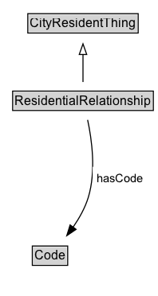

# ResidentialRelationship

A ResidentialRelationship defines the relationship of a Resident to a Residence.

## Diagram

=== "SVG (interactive)"

    <!-- Generated by graphviz version 14.1.3 (20260303.0454)
     -->
    <!-- Pages: 1 -->
    <svg width="148pt" height="279pt"
     viewBox="0.00 0.00 148.00 279.00" xmlns="http://www.w3.org/2000/svg" xmlns:xlink="http://www.w3.org/1999/xlink">
    <g id="graph0" class="graph" transform="scale(1 1) rotate(0) translate(4 275)">
    <polygon fill="white" stroke="none" points="-4,4 -4,-275 144.12,-275 144.12,4 -4,4"/>
    <g id="clust3" class="cluster">
    <title>cluster_associated</title>
    </g>
    <!-- CityResidentThing -->
    <g id="node1" class="node">
    <title>CityResidentThing</title>
    <g id="a_node1"><a xlink:href="../CityResidentThing" xlink:title="&lt;TABLE&gt;">
    <polygon fill="lightgray" stroke="none" points="23.12,-244.88 23.12,-261.12 124.88,-261.12 124.88,-244.88 23.12,-244.88"/>
    <text xml:space="preserve" text-anchor="start" x="24.12" y="-248.88" font-family="Arial" font-size="12.00">CityResidentThing</text>
    <polygon fill="none" stroke="black" points="22.12,-243.88 22.12,-262.12 125.88,-262.12 125.88,-243.88 22.12,-243.88"/>
    </a>
    </g>
    </g>
    <!-- ResidentialRelationship -->
    <g id="node2" class="node">
    <title>ResidentialRelationship</title>
    <g id="a_node2"><a xlink:href="../ResidentialRelationship" xlink:title="&lt;TABLE&gt;">
    <polygon fill="lightgray" stroke="none" points="8.88,-171.88 8.88,-188.12 139.12,-188.12 139.12,-171.88 8.88,-171.88"/>
    <text xml:space="preserve" text-anchor="start" x="9.88" y="-175.88" font-family="Arial" font-size="12.00">ResidentialRelationship</text>
    <polygon fill="none" stroke="black" points="7.88,-170.88 7.88,-189.12 140.12,-189.12 140.12,-170.88 7.88,-170.88"/>
    </a>
    </g>
    </g>
    <!-- ResidentialRelationship&#45;&gt;CityResidentThing -->
    <g id="edge1" class="edge">
    <title>ResidentialRelationship&#45;&gt;CityResidentThing</title>
    <path fill="none" stroke="black" d="M74,-197.71C74,-205.47 74,-214.92 74,-223.74"/>
    <polygon fill="none" stroke="black" points="70.5,-223.66 74,-233.66 77.5,-223.66 70.5,-223.66"/>
    </g>
    <!-- Invis -->
    <!-- ResidentialRelationship&#45;&gt;Invis -->
    <!-- Code -->
    <g id="node4" class="node">
    <title>Code</title>
    <g id="a_node4"><a xlink:href="../Code" xlink:title="&lt;TABLE&gt;">
    <polygon fill="lightgray" stroke="none" points="27.38,-25.88 27.38,-42.12 58.62,-42.12 58.62,-25.88 27.38,-25.88"/>
    <text xml:space="preserve" text-anchor="start" x="28.38" y="-29.88" font-family="Arial" font-size="12.00">Code</text>
    <polygon fill="none" stroke="black" points="26.38,-24.88 26.38,-43.12 59.62,-43.12 59.62,-24.88 26.38,-24.88"/>
    </a>
    </g>
    </g>
    <!-- ResidentialRelationship&#45;&gt;Code -->
    <g id="edge4" class="edge">
    <title>ResidentialRelationship&#45;&gt;Code</title>
    <path fill="none" stroke="black" d="M78.35,-162C82.29,-143.59 86.44,-113.56 79,-89 76,-79.08 70.5,-69.31 64.7,-60.88"/>
    <polygon fill="black" stroke="black" points="67.53,-58.82 58.77,-52.86 61.9,-62.98 67.53,-58.82"/>
    <polygon fill="white" stroke="none" points="83.12,-96.25 83.12,-117.75 134.62,-117.75 134.62,-96.25 83.12,-96.25"/>
    <text xml:space="preserve" text-anchor="start" x="87.12" y="-103.25" font-family="Arial" font-size="11.00">hasCode</text>
    </g>
    <!-- Invis&#45;&gt;Code -->
    </g>
    </svg>

=== "PNG"

    

## Formalization for ResidentialRelationship

| Property | Constraint |
|----------|------------|
| [hasCode](../properties/hasCode.md) | only [Code](https://w3id.org/citydata/part2/v1/Code) |
| subClassOf | [CityResidentThing](CityResidentThing.md) |

