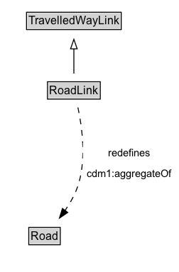

# RoadLink

A Road Link is a type of Travelled Way Link that represents a length of Road.

## Diagram

=== "SVG (interactive)"

    <!-- Generated by graphviz version 14.1.3 (20260303.0454)
     -->
    <!-- Pages: 1 -->
    <svg width="189pt" height="286pt"
     viewBox="0.00 0.00 189.00 286.00" xmlns="http://www.w3.org/2000/svg" xmlns:xlink="http://www.w3.org/1999/xlink">
    <g id="graph0" class="graph" transform="scale(1 1) rotate(0) translate(4 282)">
    <polygon fill="white" stroke="none" points="-4,4 -4,-282 184.75,-282 184.75,4 -4,4"/>
    <g id="clust3" class="cluster">
    <title>cluster_associated</title>
    </g>
    <!-- TravelledWayLink -->
    <g id="node1" class="node">
    <title>TravelledWayLink</title>
    <g id="a_node1"><a xlink:href="../TravelledWayLink" xlink:title="&lt;TABLE&gt;">
    <polygon fill="lightgray" stroke="none" points="25,-251.88 25,-268.12 123,-268.12 123,-251.88 25,-251.88"/>
    <text xml:space="preserve" text-anchor="start" x="26" y="-255.88" font-family="Arial" font-size="12.00">TravelledWayLink</text>
    <polygon fill="none" stroke="black" points="24,-250.88 24,-269.12 124,-269.12 124,-250.88 24,-250.88"/>
    </a>
    </g>
    </g>
    <!-- RoadLink -->
    <g id="node2" class="node">
    <title>RoadLink</title>
    <g id="a_node2"><a xlink:href="../RoadLink" xlink:title="&lt;TABLE&gt;">
    <polygon fill="lightgray" stroke="none" points="47.12,-178.88 47.12,-195.12 100.88,-195.12 100.88,-178.88 47.12,-178.88"/>
    <text xml:space="preserve" text-anchor="start" x="48.12" y="-182.88" font-family="Arial" font-size="12.00">RoadLink</text>
    <polygon fill="none" stroke="black" points="46.12,-177.88 46.12,-196.12 101.88,-196.12 101.88,-177.88 46.12,-177.88"/>
    </a>
    </g>
    </g>
    <!-- RoadLink&#45;&gt;TravelledWayLink -->
    <g id="edge1" class="edge">
    <title>RoadLink&#45;&gt;TravelledWayLink</title>
    <path fill="none" stroke="black" d="M74,-204.71C74,-212.47 74,-221.92 74,-230.74"/>
    <polygon fill="none" stroke="black" points="70.5,-230.66 74,-240.66 77.5,-230.66 70.5,-230.66"/>
    </g>
    <!-- Invis -->
    <!-- RoadLink&#45;&gt;Invis -->
    <!-- Road -->
    <g id="node4" class="node">
    <title>Road</title>
    <g id="a_node4"><a xlink:href="../Road" xlink:title="&lt;TABLE&gt;">
    <polygon fill="lightgray" stroke="none" points="27.38,-25.88 27.38,-42.12 58.62,-42.12 58.62,-25.88 27.38,-25.88"/>
    <text xml:space="preserve" text-anchor="start" x="28.38" y="-29.88" font-family="Arial" font-size="12.00">Road</text>
    <polygon fill="none" stroke="black" points="26.38,-24.88 26.38,-43.12 59.62,-43.12 59.62,-24.88 26.38,-24.88"/>
    </a>
    </g>
    </g>
    <!-- RoadLink&#45;&gt;Road -->
    <g id="edge4" class="edge">
    <title>RoadLink&#45;&gt;Road</title>
    <path fill="none" stroke="black" stroke-dasharray="5,2" d="M78.28,-169.11C82.49,-149.42 87.21,-116.11 79,-89 76,-79.08 70.5,-69.31 64.7,-60.88"/>
    <polygon fill="black" stroke="black" points="67.53,-58.82 58.77,-52.86 61.9,-62.98 67.53,-58.82"/>
    <polygon fill="white" stroke="none" points="83.5,-89 83.5,-132 180.75,-132 180.75,-89 83.5,-89"/>
    <text xml:space="preserve" text-anchor="start" x="110" y="-117.5" font-family="Arial" font-size="11.00">redefines</text>
    <text xml:space="preserve" text-anchor="start" x="87.5" y="-96" font-family="Arial" font-size="11.00">cdm1:aggregateOf</text>
    </g>
    <!-- Invis&#45;&gt;Road -->
    </g>
    </svg>

=== "PNG"

    

## Formalization for RoadLink

| Property | Constraint |
|----------|------------|
| [cdm1:aggregateOf](https://w3id.org/citydata/part1/v1/aggregateOf) | only [Road](https://w3id.org/citydata/part2/v1/Road) |
| subClassOf | [TravelledWayLink](TravelledWayLink.md) |

