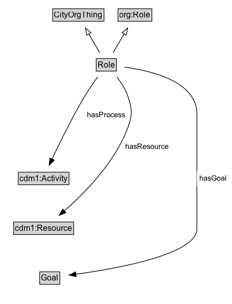

# Role

A Role has a single, possibly complex, Goal.

## Diagram

=== "SVG (interactive)"

    <!-- Generated by graphviz version 14.1.3 (20260303.0454)
     -->
    <!-- Pages: 1 -->
    <svg width="341pt" height="446pt"
     viewBox="0.00 0.00 341.00 446.00" xmlns="http://www.w3.org/2000/svg" xmlns:xlink="http://www.w3.org/1999/xlink">
    <g id="graph0" class="graph" transform="scale(1 1) rotate(0) translate(4 441.5)">
    <polygon fill="white" stroke="none" points="-4,4 -4,-441.5 336.75,-441.5 336.75,4 -4,4"/>
    <g id="clust3" class="cluster">
    <title>cluster_associated</title>
    </g>
    <!-- CityOrgThing -->
    <g id="node1" class="node">
    <title>CityOrgThing</title>
    <g id="a_node1"><a xlink:href="../CityOrgThing" xlink:title="&lt;TABLE&gt;">
    <polygon fill="lightgray" stroke="none" points="74.38,-411.38 74.38,-427.62 147.62,-427.62 147.62,-411.38 74.38,-411.38"/>
    <text xml:space="preserve" text-anchor="start" x="75.38" y="-415.38" font-family="Arial" font-size="12.00">CityOrgThing</text>
    <polygon fill="none" stroke="black" points="73.38,-410.38 73.38,-428.62 148.62,-428.62 148.62,-410.38 73.38,-410.38"/>
    </a>
    </g>
    </g>
    <!-- org_Role -->
    <g id="node2" class="node">
    <title>org_Role</title>
    <g id="a_node2"><a xlink:href="https://w3id.org/citydata/imported/org/latest/Role" xlink:title="&lt;TABLE&gt;">
    <polygon fill="lightgray" stroke="none" points="170.12,-411.38 170.12,-427.62 217.88,-427.62 217.88,-411.38 170.12,-411.38"/>
    <text xml:space="preserve" text-anchor="start" x="171.12" y="-415.38" font-family="Arial" font-size="12.00">org:Role</text>
    <polygon fill="none" stroke="black" points="169.12,-410.38 169.12,-428.62 218.88,-428.62 218.88,-410.38 169.12,-410.38"/>
    </a>
    </g>
    </g>
    <!-- Role -->
    <g id="node3" class="node">
    <title>Role</title>
    <g id="a_node3"><a xlink:href="../Role" xlink:title="&lt;TABLE&gt;">
    <polygon fill="lightgray" stroke="none" points="138.25,-338.38 138.25,-354.62 165.75,-354.62 165.75,-338.38 138.25,-338.38"/>
    <text xml:space="preserve" text-anchor="start" x="139.25" y="-342.38" font-family="Arial" font-size="12.00">Role</text>
    <polygon fill="none" stroke="black" points="137.25,-337.38 137.25,-355.62 166.75,-355.62 166.75,-337.38 137.25,-337.38"/>
    </a>
    </g>
    </g>
    <!-- Role&#45;&gt;CityOrgThing -->
    <g id="edge1" class="edge">
    <title>Role&#45;&gt;CityOrgThing</title>
    <path fill="none" stroke="black" d="M142.35,-364.21C137.62,-372.41 131.79,-382.5 126.45,-391.74"/>
    <polygon fill="none" stroke="black" points="123.44,-389.95 121.47,-400.36 129.51,-393.45 123.44,-389.95"/>
    </g>
    <!-- Role&#45;&gt;org_Role -->
    <g id="edge2" class="edge">
    <title>Role&#45;&gt;org_Role</title>
    <path fill="none" stroke="black" d="M161.88,-364.21C166.79,-372.5 172.83,-382.71 178.35,-392.04"/>
    <polygon fill="none" stroke="black" points="175.17,-393.55 183.28,-400.37 181.2,-389.98 175.17,-393.55"/>
    </g>
    <!-- Invis -->
    <!-- Role&#45;&gt;Invis -->
    <!-- cdm1_Activity -->
    <g id="node5" class="node">
    <title>cdm1_Activity</title>
    <g id="a_node5"><a xlink:href="https://w3id.org/citydata/part1/v1/Activity" xlink:title="&lt;TABLE&gt;">
    <polygon fill="lightgray" stroke="none" points="23.75,-171.88 23.75,-188.12 96.25,-188.12 96.25,-171.88 23.75,-171.88"/>
    <text xml:space="preserve" text-anchor="start" x="24.75" y="-175.88" font-family="Arial" font-size="12.00">cdm1:Activity</text>
    <polygon fill="none" stroke="black" points="22.75,-170.88 22.75,-189.12 97.25,-189.12 97.25,-170.88 22.75,-170.88"/>
    </a>
    </g>
    </g>
    <!-- Role&#45;&gt;cdm1_Activity -->
    <g id="edge7" class="edge">
    <title>Role&#45;&gt;cdm1_Activity</title>
    <path fill="none" stroke="black" d="M139.45,-328.85C133.22,-320.28 125.76,-309.54 119.75,-299.5 101.59,-269.15 83.73,-232.6 72.33,-208.19"/>
    <polygon fill="black" stroke="black" points="75.58,-206.88 68.21,-199.27 69.23,-209.81 75.58,-206.88"/>
    <polygon fill="white" stroke="none" points="119.75,-262.75 119.75,-284.25 184,-284.25 184,-262.75 119.75,-262.75"/>
    <text xml:space="preserve" text-anchor="start" x="123.75" y="-269.75" font-family="Arial" font-size="11.00">hasProcess</text>
    </g>
    <!-- cdm1_Resource -->
    <g id="node6" class="node">
    <title>cdm1_Resource</title>
    <g id="a_node6"><a xlink:href="https://w3id.org/citydata/part1/v1/Resource" xlink:title="&lt;TABLE&gt;">
    <polygon fill="lightgray" stroke="none" points="17,-98.88 17,-115.12 103,-115.12 103,-98.88 17,-98.88"/>
    <text xml:space="preserve" text-anchor="start" x="18" y="-102.88" font-family="Arial" font-size="12.00">cdm1:Resource</text>
    <polygon fill="none" stroke="black" points="16,-97.88 16,-116.12 104,-116.12 104,-97.88 16,-97.88"/>
    </a>
    </g>
    </g>
    <!-- Role&#45;&gt;cdm1_Resource -->
    <g id="edge9" class="edge">
    <title>Role&#45;&gt;cdm1_Resource</title>
    <path fill="none" stroke="black" d="M167.55,-328.51C173.97,-320.36 180.68,-310.08 184,-299.5 189.85,-280.84 190.66,-273.89 184,-255.5 165.48,-204.4 120.53,-158.75 90.15,-132.22"/>
    <polygon fill="black" stroke="black" points="92.65,-129.75 82.77,-125.92 88.1,-135.07 92.65,-129.75"/>
    <polygon fill="white" stroke="none" points="176.17,-216 176.17,-237.5 247.92,-237.5 247.92,-216 176.17,-216"/>
    <text xml:space="preserve" text-anchor="start" x="180.17" y="-223" font-family="Arial" font-size="11.00">hasResource</text>
    </g>
    <!-- Goal -->
    <g id="node7" class="node">
    <title>Goal</title>
    <g id="a_node7"><a xlink:href="../Goal" xlink:title="&lt;TABLE&gt;">
    <polygon fill="lightgray" stroke="none" points="55.25,-25.88 55.25,-42.12 82.75,-42.12 82.75,-25.88 55.25,-25.88"/>
    <text xml:space="preserve" text-anchor="start" x="56.25" y="-29.88" font-family="Arial" font-size="12.00">Goal</text>
    <polygon fill="none" stroke="black" points="54.25,-24.88 54.25,-43.12 83.75,-43.12 83.75,-24.88 54.25,-24.88"/>
    </a>
    </g>
    </g>
    <!-- Role&#45;&gt;Goal -->
    <g id="edge8" class="edge">
    <title>Role&#45;&gt;Goal</title>
    <path fill="none" stroke="black" d="M178.91,-343.07C217.78,-337.93 285,-322.14 285,-274.5 285,-274.5 285,-274.5 285,-106 285,-69.01 169.23,-48.13 107.2,-39.59"/>
    <polygon fill="black" stroke="black" points="107.79,-36.14 97.42,-38.29 106.87,-43.08 107.79,-36.14"/>
    <polygon fill="white" stroke="none" points="285,-169.25 285,-190.75 332.75,-190.75 332.75,-169.25 285,-169.25"/>
    <text xml:space="preserve" text-anchor="start" x="289" y="-176.25" font-family="Arial" font-size="11.00">hasGoal</text>
    </g>
    <!-- Invis&#45;&gt;cdm1_Activity -->
    <!-- cdm1_Activity&#45;&gt;cdm1_Resource -->
    <!-- cdm1_Resource&#45;&gt;Goal -->
    </g>
    </svg>

=== "PNG"

    

## Formalization for Role

| Property | Constraint |
|----------|------------|
| [hasGoal](../properties/hasGoal.md) | only [Goal](https://w3id.org/citydata/part2/v1/Goal) |
| [hasProcess](../properties/hasProcess.md) | only [cdm1:Activity](https://w3id.org/citydata/part1/v1/Activity) |
| [hasResource](../properties/hasResource.md) | only [cdm1:Resource](https://w3id.org/citydata/part1/v1/Resource) |
| subClassOf | [org:Role](https://w3id.org/citydata/imported/org/Role) |
| subClassOf | [CityOrgThing](CityOrgThing.md) |

