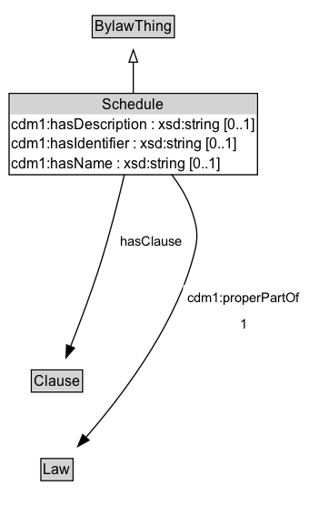

# Schedule

A Schedule is a component of a bylaw that outlines specific provisions, terms, or details related to the main content of the document.

## Diagram

=== "SVG (interactive)"

    <!-- Generated by graphviz version 14.1.3 (20260303.0454)
     -->
    <!-- Pages: 1 -->
    <svg width="255pt" height="425pt"
     viewBox="0.00 0.00 255.00 425.00" xmlns="http://www.w3.org/2000/svg" xmlns:xlink="http://www.w3.org/1999/xlink">
    <g id="graph0" class="graph" transform="scale(1 1) rotate(0) translate(4 421)">
    <polygon fill="white" stroke="none" points="-4,4 -4,-421 251.35,-421 251.35,4 -4,4"/>
    <g id="clust3" class="cluster">
    <title>cluster_associated</title>
    </g>
    <!-- BylawThing -->
    <g id="node1" class="node">
    <title>BylawThing</title>
    <g id="a_node1"><a xlink:href="../BylawThing" xlink:title="&lt;TABLE&gt;">
    <polygon fill="lightgray" stroke="none" points="73.12,-390.88 73.12,-407.12 138.88,-407.12 138.88,-390.88 73.12,-390.88"/>
    <text xml:space="preserve" text-anchor="start" x="74.12" y="-394.88" font-family="Arial" font-size="12.00">BylawThing</text>
    <polygon fill="none" stroke="black" points="72.12,-389.88 72.12,-408.12 139.88,-408.12 139.88,-389.88 72.12,-389.88"/>
    </a>
    </g>
    </g>
    <!-- Schedule -->
    <g id="node2" class="node">
    <title>Schedule</title>
    <g id="a_node2"><a xlink:href="../Schedule" xlink:title="&lt;TABLE&gt;">
    <polygon fill="lightgray" stroke="none" points="4.5,-326.75 4.5,-343 207.5,-343 207.5,-326.75 4.5,-326.75"/>
    <text xml:space="preserve" text-anchor="start" x="80.5" y="-330.75" font-family="Arial" font-size="12.00">Schedule</text>
    <text xml:space="preserve" text-anchor="start" x="5.5" y="-314.5" font-family="Arial" font-size="12.00">cdm1:hasDescription : xsd:string [0..1]</text>
    <text xml:space="preserve" text-anchor="start" x="5.5" y="-298.25" font-family="Arial" font-size="12.00">cdm1:hasIdentifier : xsd:string [0..1]</text>
    <text xml:space="preserve" text-anchor="start" x="5.5" y="-282" font-family="Arial" font-size="12.00">cdm1:hasName : xsd:string [0..1]</text>
    <polygon fill="none" stroke="black" points="3.5,-277 3.5,-344 208.5,-344 208.5,-277 3.5,-277"/>
    </a>
    </g>
    </g>
    <!-- Schedule&#45;&gt;BylawThing -->
    <g id="edge1" class="edge">
    <title>Schedule&#45;&gt;BylawThing</title>
    <path fill="none" stroke="black" d="M106,-343.89C106,-352.45 106,-361.62 106,-369.93"/>
    <polygon fill="none" stroke="black" points="102.5,-369.81 106,-379.81 109.5,-369.81 102.5,-369.81"/>
    </g>
    <!-- Invis -->
    <!-- Schedule&#45;&gt;Invis -->
    <!-- Clause -->
    <g id="node4" class="node">
    <title>Clause</title>
    <g id="a_node4"><a xlink:href="../Clause" xlink:title="&lt;TABLE&gt;">
    <polygon fill="lightgray" stroke="none" points="22.88,-98.88 22.88,-115.12 63.12,-115.12 63.12,-98.88 22.88,-98.88"/>
    <text xml:space="preserve" text-anchor="start" x="23.88" y="-102.88" font-family="Arial" font-size="12.00">Clause</text>
    <polygon fill="none" stroke="black" points="21.88,-97.88 21.88,-116.12 64.12,-116.12 64.12,-97.88 21.88,-97.88"/>
    </a>
    </g>
    </g>
    <!-- Schedule&#45;&gt;Clause -->
    <g id="edge6" class="edge">
    <title>Schedule&#45;&gt;Clause</title>
    <path fill="none" stroke="black" d="M98.74,-277.39C93.75,-256.36 86.66,-228.35 79,-204 71.63,-180.55 61.73,-154.46 54.18,-135.4"/>
    <polygon fill="black" stroke="black" points="57.46,-134.19 50.5,-126.21 50.97,-136.79 57.46,-134.19"/>
    <polygon fill="white" stroke="none" points="91.23,-211.25 91.23,-232.75 150.23,-232.75 150.23,-211.25 91.23,-211.25"/>
    <text xml:space="preserve" text-anchor="start" x="95.23" y="-218.25" font-family="Arial" font-size="11.00">hasClause</text>
    </g>
    <!-- Law -->
    <g id="node5" class="node">
    <title>Law</title>
    <g id="a_node5"><a xlink:href="../Law" xlink:title="&lt;TABLE&gt;">
    <polygon fill="lightgray" stroke="none" points="30.75,-25.88 30.75,-42.12 55.25,-42.12 55.25,-25.88 30.75,-25.88"/>
    <text xml:space="preserve" text-anchor="start" x="31.75" y="-29.88" font-family="Arial" font-size="12.00">Law</text>
    <polygon fill="none" stroke="black" points="29.75,-24.88 29.75,-43.12 56.25,-43.12 56.25,-24.88 29.75,-24.88"/>
    </a>
    </g>
    </g>
    <!-- Schedule&#45;&gt;Law -->
    <g id="edge5" class="edge">
    <title>Schedule&#45;&gt;Law</title>
    <path fill="none" stroke="black" d="M137.62,-277.12C144.31,-268.34 150.43,-258.37 154,-248 160.36,-229.51 159.57,-222.74 154,-204 137.07,-147.04 93.99,-91.51 66.75,-60.43"/>
    <polygon fill="black" stroke="black" points="69.47,-58.21 60.19,-53.09 64.25,-62.88 69.47,-58.21"/>
    <polygon fill="white" stroke="none" points="147.1,-143 147.1,-186 247.35,-186 247.35,-143 147.1,-143"/>
    <text xml:space="preserve" text-anchor="start" x="151.1" y="-171.5" font-family="Arial" font-size="11.00">cdm1:properPartOf</text>
    <text xml:space="preserve" text-anchor="start" x="194.22" y="-150" font-family="Arial" font-size="11.00">1</text>
    </g>
    <!-- Invis&#45;&gt;Clause -->
    <!-- Clause&#45;&gt;Law -->
    </g>
    </svg>

=== "PNG"

    

## Formalization for Schedule

| Property | Constraint |
|----------|------------|
| [cdm1:hasDescription](https://w3id.org/citydata/part1/v1/hasDescription) | max 1 |
| [cdm1:hasDescription](https://w3id.org/citydata/part1/v1/hasDescription) | max 1 xsd:string |
| [cdm1:hasIdentifier](https://w3id.org/citydata/part1/v1/hasIdentifier) | max 1 |
| [cdm1:hasIdentifier](https://w3id.org/citydata/part1/v1/hasIdentifier) | max 1 xsd:string |
| [cdm1:hasName](https://w3id.org/citydata/part1/v1/hasName) | max 1 |
| [cdm1:hasName](https://w3id.org/citydata/part1/v1/hasName) | max 1 xsd:string |
| [cdm1:properPartOf](https://w3id.org/citydata/part1/v1/properPartOf) | exactly 1 |
| [cdm1:properPartOf](https://w3id.org/citydata/part1/v1/properPartOf) | exactly 1 [Law](https://w3id.org/citydata/part2/v1/Law) |
| [hasClause](../properties/hasClause.md) | only [Clause](https://w3id.org/citydata/part2/v1/Clause) |
| subClassOf | [BylawThing](BylawThing.md) |

