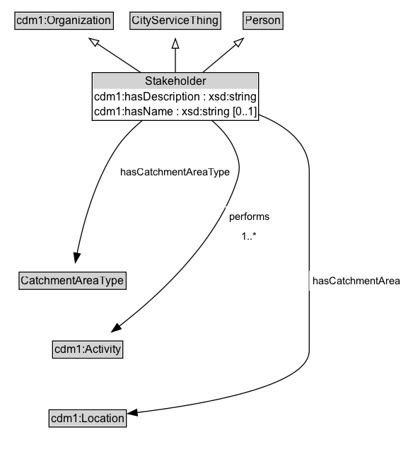

# Stakeholder

A Stakeholder is an Organization or Person that has an interest in a Program or Service.

## Diagram

=== "SVG (interactive)"

    <!-- Generated by graphviz version 14.1.3 (20260303.0454)
     -->
    <!-- Pages: 1 -->
    <svg width="433pt" height="482pt"
     viewBox="0.00 0.00 433.00 482.00" xmlns="http://www.w3.org/2000/svg" xmlns:xlink="http://www.w3.org/1999/xlink">
    <g id="graph0" class="graph" transform="scale(1 1) rotate(0) translate(4 477.75)">
    <polygon fill="white" stroke="none" points="-4,4 -4,-477.75 429,-477.75 429,4 -4,4"/>
    <g id="clust3" class="cluster">
    <title>cluster_associated</title>
    </g>
    <!-- cdm1_Organization -->
    <g id="node1" class="node">
    <title>cdm1_Organization</title>
    <g id="a_node1"><a xlink:href="https://w3id.org/citydata/part1/v1/Organization" xlink:title="&lt;TABLE&gt;">
    <polygon fill="lightgray" stroke="none" points="12.75,-447.62 12.75,-463.88 115.25,-463.88 115.25,-447.62 12.75,-447.62"/>
    <text xml:space="preserve" text-anchor="start" x="13.75" y="-451.62" font-family="Arial" font-size="12.00">cdm1:Organization</text>
    <polygon fill="none" stroke="black" points="11.75,-446.62 11.75,-464.88 116.25,-464.88 116.25,-446.62 11.75,-446.62"/>
    </a>
    </g>
    </g>
    <!-- CityServiceThing -->
    <g id="node2" class="node">
    <title>CityServiceThing</title>
    <g id="a_node2"><a xlink:href="../CityServiceThing" xlink:title="&lt;TABLE&gt;">
    <polygon fill="lightgray" stroke="none" points="134.88,-447.62 134.88,-463.88 229.12,-463.88 229.12,-447.62 134.88,-447.62"/>
    <text xml:space="preserve" text-anchor="start" x="135.88" y="-451.62" font-family="Arial" font-size="12.00">CityServiceThing</text>
    <polygon fill="none" stroke="black" points="133.88,-446.62 133.88,-464.88 230.12,-464.88 230.12,-446.62 133.88,-446.62"/>
    </a>
    </g>
    </g>
    <!-- Person -->
    <g id="node3" class="node">
    <title>Person</title>
    <g id="a_node3"><a xlink:href="../Person" xlink:title="&lt;TABLE&gt;">
    <polygon fill="lightgray" stroke="none" points="254.88,-447.62 254.88,-463.88 295.12,-463.88 295.12,-447.62 254.88,-447.62"/>
    <text xml:space="preserve" text-anchor="start" x="255.88" y="-451.62" font-family="Arial" font-size="12.00">Person</text>
    <polygon fill="none" stroke="black" points="253.88,-446.62 253.88,-464.88 296.12,-464.88 296.12,-446.62 253.88,-446.62"/>
    </a>
    </g>
    </g>
    <!-- Stakeholder -->
    <g id="node4" class="node">
    <title>Stakeholder</title>
    <g id="a_node4"><a xlink:href="../Stakeholder" xlink:title="&lt;TABLE&gt;">
    <polygon fill="lightgray" stroke="none" points="94.75,-383.5 94.75,-399.75 269.25,-399.75 269.25,-383.5 94.75,-383.5"/>
    <text xml:space="preserve" text-anchor="start" x="149.75" y="-387.5" font-family="Arial" font-size="12.00">Stakeholder</text>
    <text xml:space="preserve" text-anchor="start" x="95.75" y="-371.25" font-family="Arial" font-size="12.00">cdm1:hasDescription : xsd:string</text>
    <text xml:space="preserve" text-anchor="start" x="95.75" y="-355" font-family="Arial" font-size="12.00">cdm1:hasName : xsd:string [0..1]</text>
    <polygon fill="none" stroke="black" points="93.75,-350 93.75,-400.75 270.25,-400.75 270.25,-350 93.75,-350"/>
    </a>
    </g>
    </g>
    <!-- Stakeholder&#45;&gt;cdm1_Organization -->
    <g id="edge1" class="edge">
    <title>Stakeholder&#45;&gt;cdm1_Organization</title>
    <path fill="none" stroke="black" d="M145.53,-400.6C130.58,-410.53 113.36,-421.97 98.6,-431.77"/>
    <polygon fill="none" stroke="black" points="96.97,-428.65 90.57,-437.1 100.84,-434.48 96.97,-428.65"/>
    </g>
    <!-- Stakeholder&#45;&gt;CityServiceThing -->
    <g id="edge2" class="edge">
    <title>Stakeholder&#45;&gt;CityServiceThing</title>
    <path fill="none" stroke="black" d="M182,-400.71C182,-408.97 182,-418.27 182,-426.79"/>
    <polygon fill="none" stroke="black" points="178.5,-426.62 182,-436.62 185.5,-426.62 178.5,-426.62"/>
    </g>
    <!-- Stakeholder&#45;&gt;Person -->
    <g id="edge3" class="edge">
    <title>Stakeholder&#45;&gt;Person</title>
    <path fill="none" stroke="black" d="M210.88,-400.71C222.26,-410.3 235.29,-421.28 246.62,-430.83"/>
    <polygon fill="none" stroke="black" points="244.22,-433.39 254.12,-437.15 248.73,-428.03 244.22,-433.39"/>
    </g>
    <!-- Invis -->
    <!-- Stakeholder&#45;&gt;Invis -->
    <!-- CatchmentAreaType -->
    <g id="node6" class="node">
    <title>CatchmentAreaType</title>
    <g id="a_node6"><a xlink:href="../CatchmentAreaType" xlink:title="&lt;TABLE&gt;">
    <polygon fill="lightgray" stroke="none" points="17.25,-171.88 17.25,-188.12 128.75,-188.12 128.75,-171.88 17.25,-171.88"/>
    <text xml:space="preserve" text-anchor="start" x="18.25" y="-175.88" font-family="Arial" font-size="12.00">CatchmentAreaType</text>
    <polygon fill="none" stroke="black" points="16.25,-170.88 16.25,-189.12 129.75,-189.12 129.75,-170.88 16.25,-170.88"/>
    </a>
    </g>
    </g>
    <!-- Stakeholder&#45;&gt;CatchmentAreaType -->
    <g id="edge9" class="edge">
    <title>Stakeholder&#45;&gt;CatchmentAreaType</title>
    <path fill="none" stroke="black" d="M147.09,-350.11C137.16,-341.82 127.06,-331.87 119.75,-321 96.37,-286.24 83.79,-238.79 77.74,-209.02"/>
    <polygon fill="black" stroke="black" points="81.2,-208.46 75.89,-199.29 74.32,-209.77 81.2,-208.46"/>
    <polygon fill="white" stroke="none" points="119.75,-284.25 119.75,-305.75 244,-305.75 244,-284.25 119.75,-284.25"/>
    <text xml:space="preserve" text-anchor="start" x="123.75" y="-291.25" font-family="Arial" font-size="11.00">hasCatchmentAreaType</text>
    </g>
    <!-- cdm1_Activity -->
    <g id="node7" class="node">
    <title>cdm1_Activity</title>
    <g id="a_node7"><a xlink:href="https://w3id.org/citydata/part1/v1/Activity" xlink:title="&lt;TABLE&gt;">
    <polygon fill="lightgray" stroke="none" points="52.75,-98.88 52.75,-115.12 125.25,-115.12 125.25,-98.88 52.75,-98.88"/>
    <text xml:space="preserve" text-anchor="start" x="53.75" y="-102.88" font-family="Arial" font-size="12.00">cdm1:Activity</text>
    <polygon fill="none" stroke="black" points="51.75,-97.88 51.75,-116.12 126.25,-116.12 126.25,-97.88 51.75,-97.88"/>
    </a>
    </g>
    </g>
    <!-- Stakeholder&#45;&gt;cdm1_Activity -->
    <g id="edge8" class="edge">
    <title>Stakeholder&#45;&gt;cdm1_Activity</title>
    <path fill="none" stroke="black" d="M220.33,-350.26C229.84,-342.22 238.79,-332.36 244,-321 252.15,-303.22 251.07,-295.23 244,-277 219.71,-214.38 160.12,-160.9 122.31,-131.71"/>
    <polygon fill="black" stroke="black" points="124.49,-128.97 114.4,-125.73 120.27,-134.56 124.49,-128.97"/>
    <polygon fill="white" stroke="none" points="235.24,-216 235.24,-259 285.99,-259 285.99,-216 235.24,-216"/>
    <text xml:space="preserve" text-anchor="start" x="239.24" y="-244.5" font-family="Arial" font-size="11.00">performs</text>
    <text xml:space="preserve" text-anchor="start" x="252.37" y="-223" font-family="Arial" font-size="11.00">1..&#42;</text>
    </g>
    <!-- cdm1_Location -->
    <g id="node8" class="node">
    <title>cdm1_Location</title>
    <g id="a_node8"><a xlink:href="https://w3id.org/citydata/part1/v1/Location" xlink:title="&lt;TABLE&gt;">
    <polygon fill="lightgray" stroke="none" points="49,-25.88 49,-42.12 129,-42.12 129,-25.88 49,-25.88"/>
    <text xml:space="preserve" text-anchor="start" x="50" y="-29.88" font-family="Arial" font-size="12.00">cdm1:Location</text>
    <polygon fill="none" stroke="black" points="48,-24.88 48,-43.12 130,-43.12 130,-24.88 48,-24.88"/>
    </a>
    </g>
    </g>
    <!-- Stakeholder&#45;&gt;cdm1_Location -->
    <g id="edge10" class="edge">
    <title>Stakeholder&#45;&gt;cdm1_Location</title>
    <path fill="none" stroke="black" d="M269.91,-356.41C298.96,-344.94 324,-326.27 324,-296 324,-296 324,-296 324,-106 324,-68.05 210.28,-48.54 141.05,-40.18"/>
    <polygon fill="black" stroke="black" points="141.77,-36.74 131.44,-39.06 140.97,-43.69 141.77,-36.74"/>
    <polygon fill="white" stroke="none" points="324,-169.25 324,-190.75 425,-190.75 425,-169.25 324,-169.25"/>
    <text xml:space="preserve" text-anchor="start" x="328" y="-176.25" font-family="Arial" font-size="11.00">hasCatchmentArea</text>
    </g>
    <!-- Invis&#45;&gt;CatchmentAreaType -->
    <!-- CatchmentAreaType&#45;&gt;cdm1_Activity -->
    <!-- cdm1_Activity&#45;&gt;cdm1_Location -->
    </g>
    </svg>

=== "PNG"

    

## Formalization for Stakeholder

| Property | Constraint |
|----------|------------|
| [cdm1:hasDescription](https://w3id.org/citydata/part1/v1/hasDescription) | datatype xsd:string |
| [cdm1:hasName](https://w3id.org/citydata/part1/v1/hasName) | max 1 |
| [cdm1:hasName](https://w3id.org/citydata/part1/v1/hasName) | max 1 xsd:string |
| [hasCatchmentArea](../properties/hasCatchmentArea.md) | only [cdm1:Location](https://w3id.org/citydata/part1/v1/Location) |
| [hasCatchmentAreaType](../properties/hasCatchmentAreaType.md) | only [CatchmentAreaType](https://w3id.org/citydata/part2/v1/CatchmentAreaType) |
| [performs](../properties/performs.md) | min 1 |
| [performs](../properties/performs.md) | min 1 [cdm1:Activity](https://w3id.org/citydata/part1/v1/Activity) |
| subClassOf | [CityServiceThing](CityServiceThing.md) |

