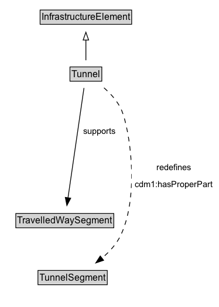

# Tunnel

A Tunnel is a Infrastructure Element that enables travel through or underneath some obstacle or area. It may contain some Road or RailLine Segments.

## Diagram

=== "SVG (interactive)"

    <!-- Generated by graphviz version 14.1.3 (20260303.0454)
     -->
    <!-- Pages: 1 -->
    <svg width="280pt" height="394pt"
     viewBox="0.00 0.00 280.00 394.00" xmlns="http://www.w3.org/2000/svg" xmlns:xlink="http://www.w3.org/1999/xlink">
    <g id="graph0" class="graph" transform="scale(1 1) rotate(0) translate(4 390)">
    <polygon fill="white" stroke="none" points="-4,4 -4,-390 276.34,-390 276.34,4 -4,4"/>
    <g id="clust3" class="cluster">
    <title>cluster_associated</title>
    </g>
    <!-- InfrastructureElement -->
    <g id="node1" class="node">
    <title>InfrastructureElement</title>
    <g id="a_node1"><a xlink:href="../InfrastructureElement" xlink:title="&lt;TABLE&gt;">
    <polygon fill="lightgray" stroke="none" points="48.38,-359.88 48.38,-376.12 163.62,-376.12 163.62,-359.88 48.38,-359.88"/>
    <text xml:space="preserve" text-anchor="start" x="49.38" y="-363.88" font-family="Arial" font-size="12.00">InfrastructureElement</text>
    <polygon fill="none" stroke="black" points="47.38,-358.88 47.38,-377.12 164.62,-377.12 164.62,-358.88 47.38,-358.88"/>
    </a>
    </g>
    </g>
    <!-- Tunnel -->
    <g id="node2" class="node">
    <title>Tunnel</title>
    <g id="a_node2"><a xlink:href="../Tunnel" xlink:title="&lt;TABLE&gt;">
    <polygon fill="lightgray" stroke="none" points="86.62,-286.88 86.62,-303.12 125.38,-303.12 125.38,-286.88 86.62,-286.88"/>
    <text xml:space="preserve" text-anchor="start" x="87.62" y="-290.88" font-family="Arial" font-size="12.00">Tunnel</text>
    <polygon fill="none" stroke="black" points="85.62,-285.88 85.62,-304.12 126.38,-304.12 126.38,-285.88 85.62,-285.88"/>
    </a>
    </g>
    </g>
    <!-- Tunnel&#45;&gt;InfrastructureElement -->
    <g id="edge1" class="edge">
    <title>Tunnel&#45;&gt;InfrastructureElement</title>
    <path fill="none" stroke="black" d="M106,-312.71C106,-320.47 106,-329.92 106,-338.74"/>
    <polygon fill="none" stroke="black" points="102.5,-338.66 106,-348.66 109.5,-338.66 102.5,-338.66"/>
    </g>
    <!-- Invis -->
    <!-- Tunnel&#45;&gt;Invis -->
    <!-- TravelledWaySegment -->
    <g id="node4" class="node">
    <title>TravelledWaySegment</title>
    <g id="a_node4"><a xlink:href="../TravelledWaySegment" xlink:title="&lt;TABLE&gt;">
    <polygon fill="lightgray" stroke="none" points="17.25,-98.88 17.25,-115.12 140.75,-115.12 140.75,-98.88 17.25,-98.88"/>
    <text xml:space="preserve" text-anchor="start" x="18.25" y="-102.88" font-family="Arial" font-size="12.00">TravelledWaySegment</text>
    <polygon fill="none" stroke="black" points="16.25,-97.88 16.25,-116.12 141.75,-116.12 141.75,-97.88 16.25,-97.88"/>
    </a>
    </g>
    </g>
    <!-- Tunnel&#45;&gt;TravelledWaySegment -->
    <g id="edge5" class="edge">
    <title>Tunnel&#45;&gt;TravelledWaySegment</title>
    <path fill="none" stroke="black" d="M103.56,-277.17C98.92,-245.22 88.8,-175.51 83.11,-136.28"/>
    <polygon fill="black" stroke="black" points="86.58,-135.82 81.68,-126.43 79.65,-136.83 86.58,-135.82"/>
    <polygon fill="white" stroke="none" points="99,-211.25 99,-232.75 148.25,-232.75 148.25,-211.25 99,-211.25"/>
    <text xml:space="preserve" text-anchor="start" x="103" y="-218.25" font-family="Arial" font-size="11.00">supports</text>
    </g>
    <!-- TunnelSegment -->
    <g id="node5" class="node">
    <title>TunnelSegment</title>
    <g id="a_node5"><a xlink:href="../TunnelSegment" xlink:title="&lt;TABLE&gt;">
    <polygon fill="lightgray" stroke="none" points="45.62,-25.88 45.62,-42.12 132.38,-42.12 132.38,-25.88 45.62,-25.88"/>
    <text xml:space="preserve" text-anchor="start" x="46.62" y="-29.88" font-family="Arial" font-size="12.00">TunnelSegment</text>
    <polygon fill="none" stroke="black" points="44.62,-24.88 44.62,-43.12 133.38,-43.12 133.38,-24.88 44.62,-24.88"/>
    </a>
    </g>
    </g>
    <!-- Tunnel&#45;&gt;TunnelSegment -->
    <g id="edge6" class="edge">
    <title>Tunnel&#45;&gt;TunnelSegment</title>
    <path fill="none" stroke="black" stroke-dasharray="5,2" d="M129.18,-277.38C138.08,-269.58 147.25,-259.48 152,-248 161.79,-224.37 175.08,-141.29 151,-89 145.61,-77.29 136.3,-67.11 126.51,-58.86"/>
    <polygon fill="black" stroke="black" points="128.72,-56.14 118.68,-52.75 124.41,-61.66 128.72,-56.14"/>
    <polygon fill="white" stroke="none" points="164.59,-143 164.59,-186 272.34,-186 272.34,-143 164.59,-143"/>
    <text xml:space="preserve" text-anchor="start" x="196.34" y="-171.5" font-family="Arial" font-size="11.00">redefines</text>
    <text xml:space="preserve" text-anchor="start" x="168.59" y="-150" font-family="Arial" font-size="11.00">cdm1:hasProperPart</text>
    </g>
    <!-- Invis&#45;&gt;TravelledWaySegment -->
    <!-- TravelledWaySegment&#45;&gt;TunnelSegment -->
    </g>
    </svg>

=== "PNG"

    

## Formalization for Tunnel

| Property | Constraint |
|----------|------------|
| [cdm1:hasProperPart](https://w3id.org/citydata/part1/v1/hasProperPart) | only [TunnelSegment](https://w3id.org/citydata/part2/v1/TunnelSegment) |
| [supports](../properties/supports.md) | only [TravelledWaySegment](https://w3id.org/citydata/part2/v1/TravelledWaySegment) |
| subClassOf | [InfrastructureElement](InfrastructureElement.md) |

