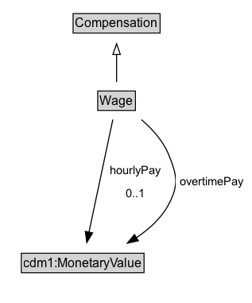

# Wage

A Wage is a form of compensation paid to an employee and is defined on an hourly basis.

## Diagram

=== "SVG (interactive)"

    <!-- Generated by graphviz version 14.1.3 (20260303.0454)
     -->
    <!-- Pages: 1 -->
    <svg width="238pt" height="286pt"
     viewBox="0.00 0.00 238.00 286.00" xmlns="http://www.w3.org/2000/svg" xmlns:xlink="http://www.w3.org/1999/xlink">
    <g id="graph0" class="graph" transform="scale(1 1) rotate(0) translate(4 282)">
    <polygon fill="white" stroke="none" points="-4,4 -4,-282 233.77,-282 233.77,4 -4,4"/>
    <g id="clust3" class="cluster">
    <title>cluster_associated</title>
    </g>
    <!-- Compensation -->
    <g id="node1" class="node">
    <title>Compensation</title>
    <g id="a_node1"><a xlink:href="../Compensation" xlink:title="&lt;TABLE&gt;">
    <polygon fill="lightgray" stroke="none" points="66,-251.88 66,-268.12 146,-268.12 146,-251.88 66,-251.88"/>
    <text xml:space="preserve" text-anchor="start" x="67" y="-255.88" font-family="Arial" font-size="12.00">Compensation</text>
    <polygon fill="none" stroke="black" points="65,-250.88 65,-269.12 147,-269.12 147,-250.88 65,-250.88"/>
    </a>
    </g>
    </g>
    <!-- Wage -->
    <g id="node2" class="node">
    <title>Wage</title>
    <g id="a_node2"><a xlink:href="../Wage" xlink:title="&lt;TABLE&gt;">
    <polygon fill="lightgray" stroke="none" points="89.25,-178.88 89.25,-195.12 122.75,-195.12 122.75,-178.88 89.25,-178.88"/>
    <text xml:space="preserve" text-anchor="start" x="90.25" y="-182.88" font-family="Arial" font-size="12.00">Wage</text>
    <polygon fill="none" stroke="black" points="88.25,-177.88 88.25,-196.12 123.75,-196.12 123.75,-177.88 88.25,-177.88"/>
    </a>
    </g>
    </g>
    <!-- Wage&#45;&gt;Compensation -->
    <g id="edge1" class="edge">
    <title>Wage&#45;&gt;Compensation</title>
    <path fill="none" stroke="black" d="M106,-204.71C106,-212.47 106,-221.92 106,-230.74"/>
    <polygon fill="none" stroke="black" points="102.5,-230.66 106,-240.66 109.5,-230.66 102.5,-230.66"/>
    </g>
    <!-- Invis -->
    <!-- Wage&#45;&gt;Invis -->
    <!-- cdm1_MonetaryValue -->
    <g id="node4" class="node">
    <title>cdm1_MonetaryValue</title>
    <g id="a_node4"><a xlink:href="https://w3id.org/citydata/part1/v1/MonetaryValue" xlink:title="&lt;TABLE&gt;">
    <polygon fill="lightgray" stroke="none" points="17.12,-25.88 17.12,-42.12 130.88,-42.12 130.88,-25.88 17.12,-25.88"/>
    <text xml:space="preserve" text-anchor="start" x="18.12" y="-29.88" font-family="Arial" font-size="12.00">cdm1:MonetaryValue</text>
    <polygon fill="none" stroke="black" points="16.12,-24.88 16.12,-43.12 131.88,-43.12 131.88,-24.88 16.12,-24.88"/>
    </a>
    </g>
    </g>
    <!-- Wage&#45;&gt;cdm1_MonetaryValue -->
    <g id="edge4" class="edge">
    <title>Wage&#45;&gt;cdm1_MonetaryValue</title>
    <path fill="none" stroke="black" d="M102.45,-169.26C97,-143.53 86.49,-93.95 79.89,-62.77"/>
    <polygon fill="black" stroke="black" points="83.37,-62.35 77.88,-53.29 76.53,-63.8 83.37,-62.35"/>
    <polygon fill="white" stroke="none" points="95.5,-89 95.5,-132 151.5,-132 151.5,-89 95.5,-89"/>
    <text xml:space="preserve" text-anchor="start" x="99.5" y="-117.5" font-family="Arial" font-size="11.00">hourlyPay</text>
    <text xml:space="preserve" text-anchor="start" x="114.5" y="-96" font-family="Arial" font-size="11.00">0..1</text>
    </g>
    <!-- Wage&#45;&gt;cdm1_MonetaryValue -->
    <g id="edge5" class="edge">
    <title>Wage&#45;&gt;cdm1_MonetaryValue</title>
    <path fill="none" stroke="black" d="M129.41,-169.2C139.29,-160.66 149.71,-149.36 155,-136.5 163.03,-116.98 164.96,-107.61 155,-89 148.14,-76.18 136.75,-65.88 124.64,-57.86"/>
    <polygon fill="black" stroke="black" points="126.51,-54.9 116.15,-52.69 122.87,-60.88 126.51,-54.9"/>
    <polygon fill="white" stroke="none" points="161.77,-99.75 161.77,-121.25 229.77,-121.25 229.77,-99.75 161.77,-99.75"/>
    <text xml:space="preserve" text-anchor="start" x="165.77" y="-106.75" font-family="Arial" font-size="11.00">overtimePay</text>
    </g>
    <!-- Invis&#45;&gt;cdm1_MonetaryValue -->
    </g>
    </svg>

=== "PNG"

    

## Formalization for Wage

| Property | Constraint |
|----------|------------|
| [hourlyPay](../properties/hourlyPay.md) | max 1 |
| [hourlyPay](../properties/hourlyPay.md) | max 1 [cdm1:MonetaryValue](https://w3id.org/citydata/part1/v1/MonetaryValue) |
| [overtimePay](../properties/overtimePay.md) | only [cdm1:MonetaryValue](https://w3id.org/citydata/part1/v1/MonetaryValue) |
| subClassOf | [Compensation](Compensation.md) |

