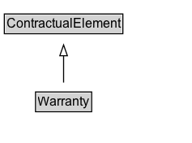

# Warranty

A Warranty is a contractual promise of some indemnification if an assertion made in the Contract is false.

## Diagram

=== "SVG (interactive)"

    <!-- Generated by graphviz version 14.1.3 (20260303.0454)
     -->
    <!-- Pages: 1 -->
    <svg width="178pt" height="132pt"
     viewBox="0.00 0.00 178.00 132.00" xmlns="http://www.w3.org/2000/svg" xmlns:xlink="http://www.w3.org/1999/xlink">
    <g id="graph0" class="graph" transform="scale(1 1) rotate(0) translate(4 128)">
    <polygon fill="white" stroke="none" points="-4,4 -4,-128 173.88,-128 173.88,4 -4,4"/>
    <g id="clust3" class="cluster">
    <title>cluster_associated</title>
    </g>
    <!-- ContractualElement -->
    <g id="node1" class="node">
    <title>ContractualElement</title>
    <g id="a_node1"><a xlink:href="../ContractualElement" xlink:title="&lt;TABLE&gt;">
    <polygon fill="lightgray" stroke="none" points="1,-97.88 1,-114.12 108.75,-114.12 108.75,-97.88 1,-97.88"/>
    <text xml:space="preserve" text-anchor="start" x="2" y="-101.88" font-family="Arial" font-size="12.00">ContractualElement</text>
    <polygon fill="none" stroke="black" points="0,-96.88 0,-115.12 109.75,-115.12 109.75,-96.88 0,-96.88"/>
    </a>
    </g>
    </g>
    <!-- Warranty -->
    <g id="node2" class="node">
    <title>Warranty</title>
    <g id="a_node2"><a xlink:href="../Warranty" xlink:title="&lt;TABLE&gt;">
    <polygon fill="lightgray" stroke="none" points="29.88,-25.88 29.88,-42.12 79.88,-42.12 79.88,-25.88 29.88,-25.88"/>
    <text xml:space="preserve" text-anchor="start" x="30.88" y="-29.88" font-family="Arial" font-size="12.00">Warranty</text>
    <polygon fill="none" stroke="black" points="28.88,-24.88 28.88,-43.12 80.88,-43.12 80.88,-24.88 28.88,-24.88"/>
    </a>
    </g>
    </g>
    <!-- Warranty&#45;&gt;ContractualElement -->
    <g id="edge1" class="edge">
    <title>Warranty&#45;&gt;ContractualElement</title>
    <path fill="none" stroke="black" d="M54.88,-51.79C54.88,-59.25 54.88,-68.24 54.88,-76.69"/>
    <polygon fill="none" stroke="black" points="51.38,-76.54 54.88,-86.54 58.38,-76.54 51.38,-76.54"/>
    </g>
    <!-- Invis -->
    </g>
    </svg>

=== "PNG"

    

## Formalization for Warranty

| Property | Constraint |
|----------|------------|
| subClassOf | [ContractualElement](ContractualElement.md) |

